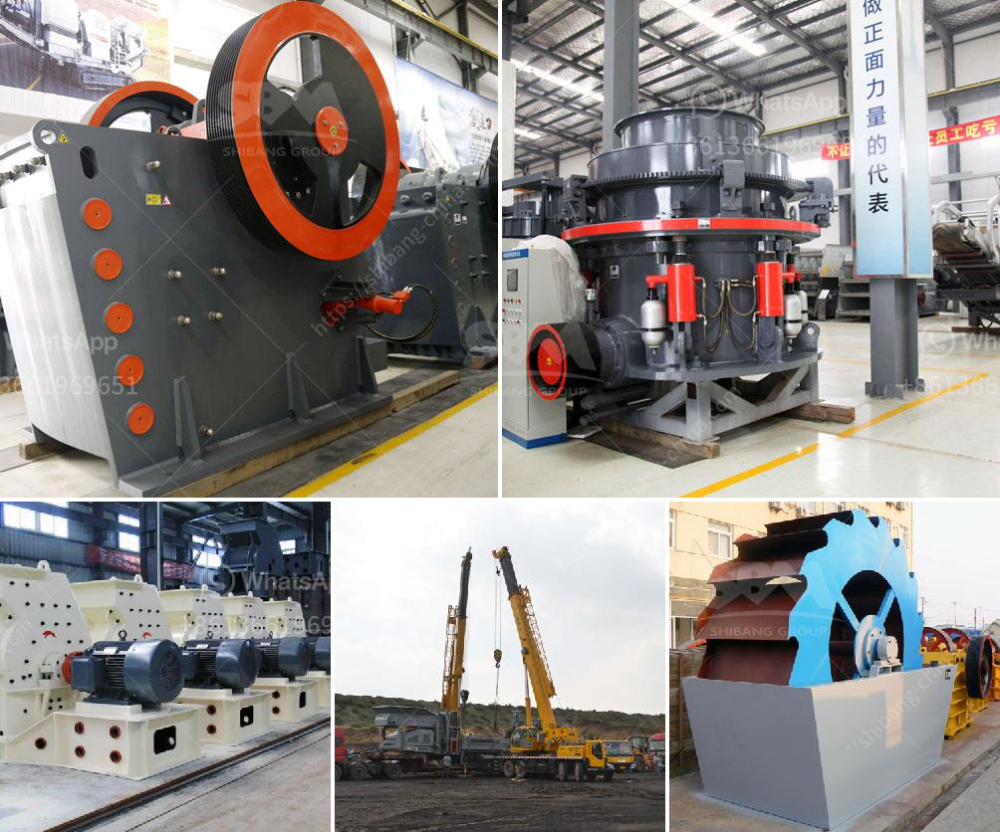

<h3>how much is limestone per ton</h3>
Limestone is a common natural stone material that is formed primarily from the remains of marine organisms such as coral and mollusks. It has been used for centuries as a building material and is widely present in construction projects worldwide. The pricing of limestone is an essential factor that architects and builders consider prior to starting any project. In this article, we will explore the price range of limestone per ton and understand its various factors.

The price of limestone per ton varies depending on several factors including its purity, color, availability, size, and overall demand in the market. On average, a ton of limestone can range anywhere from $10 to $50 or more. This price range is determined by factors such as the type of limestone, grade, and quantity purchased.

Different types of limestone have varying properties and uses. For example, agricultural limestone is primarily used to balance the soil's pH levels and promote healthy plant growth. It is typically cheaper compared to high-grade limestone used for architectural purposes, as it requires less processing. On average, agricultural limestone can cost around $20 per ton.

The grade of limestone is another important factor that impacts its price per ton. High-grade limestone, which is commonly used for architectural and construction purposes, tends to have a higher price tag. This is because high-grade limestone is often more pure, with fewer impurities and a more uniform color. The size of the limestone also affects its price per ton, as larger stones require more effort and processing to transport and handle.

Availability is another factor that influences the price of limestone. Limestone is commonly found in many regions around the world, but the availability of specific types and grades can vary. If a particular type of limestone is limited in supply, the price per ton may be higher due to increased demand and limited availability.

Overall market demand and economic factors can also impact the price of limestone per ton. In periods of high construction activity or infrastructure development, the demand for limestone tends to increase, resulting in higher prices. Conversely, during economic downturns or low construction activity, the price may decrease due to lower demand.

It is important for buyers to thoroughly research and compare prices from different suppliers before making a purchase. Prices can vary significantly depending on the supplier's location, transportation costs, and other overheads. It is also crucial to ensure that the limestone purchased meets the required quality standards for the intended application.

In conclusion, the price of limestone per ton can range from $10 to $50 or more, depending on various factors such as its grade, purity, color, availability, and overall market demand. Buyers should consider these factors and compare prices from different suppliers before making a purchase. Choosing the right type and grade of limestone, according to the specific requirements of the project, is crucial to ensure cost-effectiveness and desired results.
<h3>Contact us</h3><ul><li><strong>Whatsapp:&nbsp;<a href="https://wa.me/8613661969651">+8613661969651</a></strong></li><li><a href="https://swt.shibang-china.com/?git&amp;zhl&amp;how much is limestone per ton"><strong>Online Service(chat now)</strong></a></li></ul><h3>Related</h3><ul><li><a href='micro powder grinding mill.md'>micro powder grinding mill</a></li><li><a href='complete ore mining processing line.md'>complete ore mining processing line</a></li><li><a href='cost of stone crusher production line in china.md'>cost of stone crusher production line in china</a></li><li><a href='mtw series trapezium mill.md'>mtw series trapezium mill</a></li><li><a href='puzzolana lime stone crushing plant.md'>puzzolana lime stone crushing plant</a></li></ul>