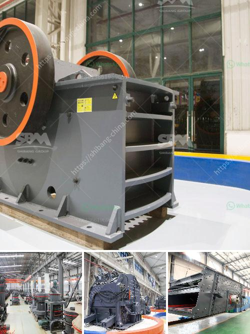

<h3>how the screw sand washing works</h3>
In today's fast-paced world, technology plays a vital role in making our daily tasks easier and more efficient. This is especially true in industries like construction and mining, where the need for high-quality sand is essential for various applications. One tool that has revolutionized the sand washing process is the screw sand washing machine.

The screw sand washing machine is a cost-effective and efficient sand washing device that uses the buoyancy of water to separate dust and impurities from sand. It utilizes a spiral-shaped stirring blade to agitate the sand and create a water and sand mixture, which then flows into a sedimentation tank where the heavier impurities settle to the bottom. On the other hand, the clean sand is lifted by the rotating screw and discharges from the upper end, resulting in a continuous washing process.

The screw sand washing machine operates by the principle of different sedimentation speeds of solid particles in water, with the aid of gravity and centrifugal force. When the machine is in operation, the motor drives the screw to rotate at a low speed through the V-belt and reducer. The sand and water mixture enters the sedimentation tank through the feeding trough, and the screw continuously stirs and pushes the sand upwards, allowing lighter impurities to float and overflow from the tank's overflow port.

Meanwhile, the spiral blades carry the sand upwards, causing it to roll and grind against each other, effectively removing impurities. The crushed particles and impurities are discharged from the overflow weir at the tank's lower end, while the clean sand is lifted by the screw and discharged through the upper discharge port. This continuous cycle of washing, agitating, and separation ensures that the sand is thoroughly cleaned and ready for various applications.

The screw sand washing machine offers several advantages over traditional sand washing methods. Firstly, it is capable of washing a wide range of materials, including crushed stone, gravel, aggregates, and industrial sands. It can effectively remove impurities such as clay, silt, and contaminants, ensuring high-quality sand output.

Secondly, it is highly efficient and can process large volumes of sand within a short span of time. The continuous washing process reduces downtime and increases productivity, making it a reliable choice for industries that require a constant supply of clean sand.

Moreover, the screw sand washing machine is easy to operate and maintain. It is equipped with a simple control panel that allows users to adjust the washing parameters according to their specific requirements. Routine maintenance involves regular cleaning and inspection of the machine's components, such as the spiral blades, bearings, and drive system, to ensure optimal performance and longevity.

In conclusion, the screw sand washing machine is an indispensable tool for the construction and mining industries. Its ability to remove impurities from sand efficiently and produce high-quality results makes it a valuable asset for any operation that requires clean sand. With its user-friendly operation and low maintenance requirements, it is no wonder that the screw sand washing machine has become a popular choice among professionals in the field.
<h3>Contact us</h3><ul><li><strong>Whatsapp:&nbsp;<a href="https://wa.me/8613661969651">+8613661969651</a></strong></li><li><a href="https://swt.shibang-china.com/?git&amp;zhl&amp;how the screw sand washing works"><strong>Online Service(chat now)</strong></a></li></ul><h3>Related</h3><ul><li><a href='grinding mills for sale in harare.md'>grinding mills for sale in harare</a></li><li><a href='calcium carbonate powder making.md'>calcium carbonate powder making</a></li><li><a href='high crushing ratio low cost jaw crusher machine.md'>high crushing ratio low cost jaw crusher machine</a></li><li><a href='china crusher contact australia.md'>china crusher contact australia</a></li><li><a href='conveyor belt supplier in riyadh.md'>conveyor belt supplier in riyadh</a></li></ul>