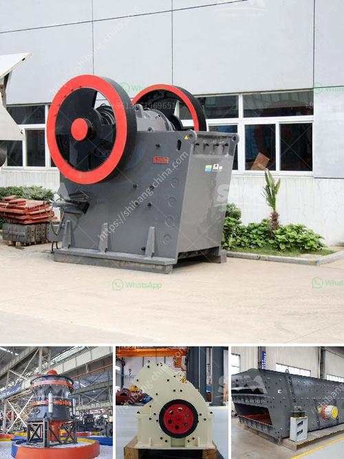

<h3>how to disassemble a cone crusher</h3>
Cone crushers are a type of compression crusher used by aggregate, coal, concrete, crushing, fracking sand, and mining industries. This type of crusher utilizes a mantle filled with crushed material and a concave, typically lined with manganese steel. As the material is fed into the top of the cone crusher, it is squeezed between the mantle and the concave.

Disassembling a cone crusher can be a challenging task if you are not familiar with the inner workings of the machine. In this article, we will explore the process of disassembling a cone crusher to help you gain the necessary expertise.

1. Prepare for the disassembly process: Before you even begin disassembling the cone crusher, you need to ensure that you have all the necessary tools and equipment. This includes safety gear such as gloves, safety glasses, and hearing protection, as well as tools like wrenches, lubricants, and pry bars.

2. Shut down the crusher: Start by shutting down the crusher and disconnecting it from the power source. This will ensure that you can safely disassemble the machine without any risk of accidental start-up.

3. Remove the feed hopper: The feed hopper is typically located above the cone crusher and contains the material that will be fed into the machine. To remove the feed hopper, loosen the screws or bolts that hold it in place and carefully lift it off the crusher.

4. Remove the mantle: The mantle is the component that sits on top of the main shaft and rotates with the eccentric motion of the crusher. It is usually held in place by a main shaft nut or a mantle liner. To remove the mantle, you will need to first remove the main shaft nut or liner, depending on the design of your cone crusher. Once the nut or liner is removed, carefully lift the mantle off the machine.

5. Remove the concave: The concave is the fixed, outer surface of the cone crusher that is lined with manganese steel. It is designed to support the mantle and provide an area for the crushed material to move through. To remove the concave, you will need to loosen the bolts or screws that hold it in place. Once the fasteners are removed, lift the concave off the machine.

6. Disassemble the remaining components: With the mantle and concave removed, you can now disassemble the remaining components such as the spider arm assembly, eccentric bushing, and main shaft. Refer to the manufacturer's instructions or consult a professional if you are unsure about the proper disassembly process.

Disassembling a cone crusher requires careful attention to detail and knowledge of the machine's inner workings. By following the steps outlined in this article, you can safely and effectively disassemble your cone crusher. However, if you are unsure or uncomfortable with the process, it is always best to consult a professional technician to ensure the work is done correctly.
<h3>Contact us</h3><ul><li><strong>Whatsapp:&nbsp;<a href="https://wa.me/8613661969651">+8613661969651</a></strong></li><li><a href="https://swt.shibang-china.com/?git&amp;zhl&amp;how to disassemble a cone crusher"><strong>Online Service(chat now)</strong></a></li></ul><h3>Related</h3><ul><li><a href='cement mill plant design drawings.md'>cement mill plant design drawings</a></li><li><a href='mobile stone crusher plant on hire in india.md'>mobile stone crusher plant on hire in india</a></li><li><a href='granite crushing line.md'>granite crushing line</a></li><li><a href='quartz ball mill.md'>quartz ball mill</a></li><li><a href='grinding mill for sale servants.md'>grinding mill for sale servants</a></li></ul>