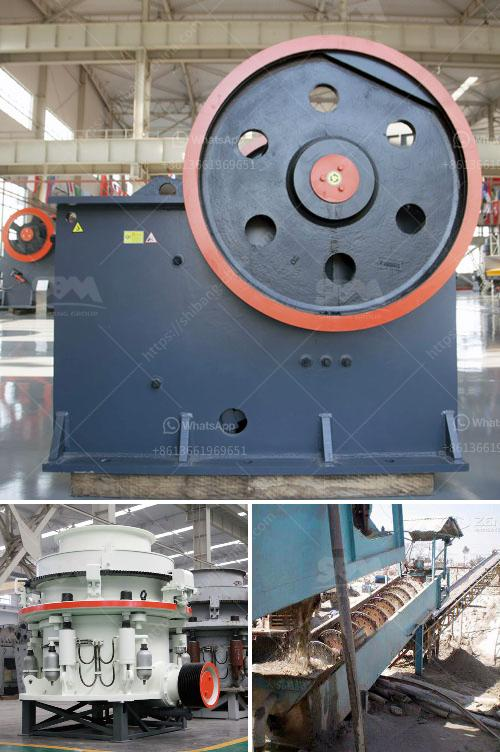

<h3>how to dismantle a cone crusher</h3>
A cone crusher is an essential part of many industrial and mining processes. It is mainly used to crush rocks and ore, such as granite, iron ore, limestone, quartz, and more. So, how does a cone crusher work? And more importantly, how can you dismantle one safely and efficiently? In this article, we will guide you through the process of dismantling a cone crusher.

Before starting, ensure that all power sources are turned off and the machinery is no longer operational. Safety should always be the top priority, so make sure everyone involved is wearing protective gear such as goggles, gloves, and hardhats.

1. Disconnect the power supply: Before dismantling the cone crusher, disconnect all power sources to prevent any accidental activation of the machine during the dismantling process. This ensures the safety of the operators and allows for better access to the components.

2. Empty the cone crusher: Start by removing the top shell and dust seal ring. These can be loosened with various tools depending on the crusher model. Once removed, carefully inspect the components for any wear and tear or damage. It's important to address any issues before reassembling the crusher later.

3. Remove the concave and mantle: The concave and mantle are another important part of the cone crusher. These should be carefully removed using tooling or lifting equipment, following the manufacturer's instructions. Take note of the crusher rotation direction for easier reinstallation.

4. Disassemble the bowl assembly: The bowl assembly is the main part of the crusher that holds the cone in place. To disassemble it, start by removing the countershaft box guard and then loosening the locking bolts. Next, use lifting equipment to remove the bowl liner and place it on a suitable surface.

5. Inspect, clean, and repair: Once all the main components are dismantled, thoroughly inspect them for any damage, wear, or potential failures. Clean all parts carefully and consider performing any required repairs or replacements before reassembling the crusher.

Dismantling a cone crusher requires careful planning, attention to safety procedures, and following the manufacturer's instructions. If in doubt, refer to the equipment's user manual or consult a professional technician. By dismantling a cone crusher correctly, you can ensure its optimal performance and longevity while minimizing any potential hazards.
<h3>Contact us</h3><ul><li><strong>Whatsapp:&nbsp;<a href="https://wa.me/8613661969651">+8613661969651</a></strong></li><li><a href="https://swt.shibang-china.com/?git&amp;zhl&amp;how to dismantle a cone crusher"><strong>Online Service(chat now)</strong></a></li></ul><h3>Related</h3><ul><li><a href='jaw industry limestone process.md'>jaw industry limestone process</a></li><li><a href='ball mill in peru.md'>ball mill in peru</a></li><li><a href='rock crusher cost.md'>rock crusher cost</a></li><li><a href='stone pickers machine in india.md'>stone pickers machine in india</a></li><li><a href='small limestone plant.md'>small limestone plant</a></li></ul>