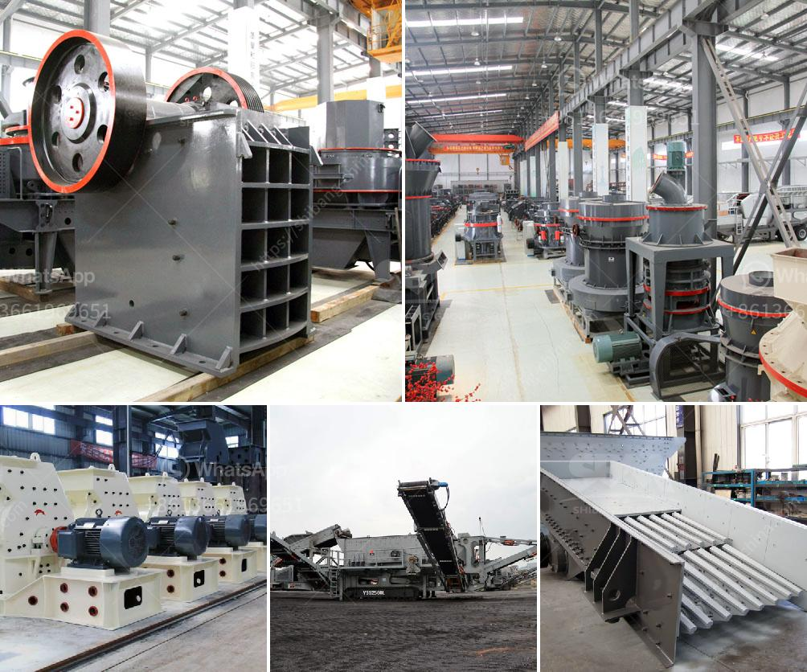

<h3>how to grind mica for powder in small scale</h3>
Mica is a naturally occurring mineral with various valuable properties. It is widely used in industries such as cosmetics, paint, plastic, and electrical insulation. Grinding mica into a fine powder can be a difficult, yet rewarding process. Small-scale grinding methods, like those used in craft and hobby shops, can be effective in grinding mica flakes or powder into a fine, uniform consistency. With the right techniques and equipment, anyone can grind mica at a small scale.

To start grinding mica, you will need a few key supplies. Firstly, you will need mica flakes or powder, which can be purchased from a variety of sources, such as online retailers or craft stores. You will also need a mortar and pestle or a coffee grinder, as these tools are suitable for small-scale grinding.

1. Prepare the mica flakes: If you have purchased mica flakes, you can skip this step. However, if you have larger mica pieces, break them into smaller flakes using a hammer or similar tool. This will make it easier to grind them later.

2. Choose the grinding tool: Depending on your preference and the available tools, you can either use a mortar and pestle or a coffee grinder to grind the mica flakes. Mortar and pestle are recommended for smaller amounts, while a coffee grinder is suitable for larger quantities.

3. Grinding process with a mortar and pestle: Take a handful of mica flakes and place them in the mortar. Using the pestle, start crushing the flakes by pressing and grinding them against the bottom and sides of the mortar. Move the pestle in a circular motion to ensure even grinding. Continue grinding until the flakes turn into a fine powder.

4. Grinding process with a coffee grinder: If using a coffee grinder, ensure that it is clean and dry. Place a small amount of mica flakes in the grinder, making sure not to overfill it. Close the lid firmly and pulse the grinder in short bursts. This will break down the mica flakes into a finer powder. Be careful not to grind for too long as this may cause excessive heat, which could affect the quality of the mica powder.

5. Sieving the powder: Once the mica is ground into a fine powder, it may still contain some larger particles. To obtain a more uniform consistency, sieve the powder using a fine mesh strainer or a flour sifter. This will remove any remaining larger particles, leaving you with a fine, homogeneous mica powder.

6. Storing the mica powder: Transfer the freshly ground mica powder into an airtight container, preferably a glass jar, to protect it from moisture and air. Store the container in a cool, dry place away from direct sunlight. Proper storage will help preserve the quality and longevity of your mica powder.

Grinding mica into a fine powder at a small scale may require some experimentation to find the right technique and equipment that works best for you. However, with patience and practice, you can achieve a finely ground mica powder suitable for various applications. Remember to take necessary safety precautions while grinding, such as wearing a dust mask and goggles to protect yourself from inhaling or getting the powder in your eyes.
<h3>Contact us</h3><ul><li><strong>Whatsapp:&nbsp;<a href="https://wa.me/8613661969651">+8613661969651</a></strong></li><li><a href="https://swt.shibang-china.com/?git&amp;zhl&amp;how to grind mica for powder in small scale"><strong>Online Service(chat now)</strong></a></li></ul><h3>Related</h3><ul><li><a href='total cost of machinery of stone crusher.md'>total cost of machinery of stone crusher</a></li><li><a href='portable concrete crusher construction waste.md'>portable concrete crusher construction waste</a></li><li><a href='prices continuous ball mill.md'>prices continuous ball mill</a></li><li><a href='old impact crushing plant for sale.md'>old impact crushing plant for sale</a></li><li><a href='design calculation of the jaw crusher pdf.md'>design calculation of the jaw crusher pdf</a></li></ul>