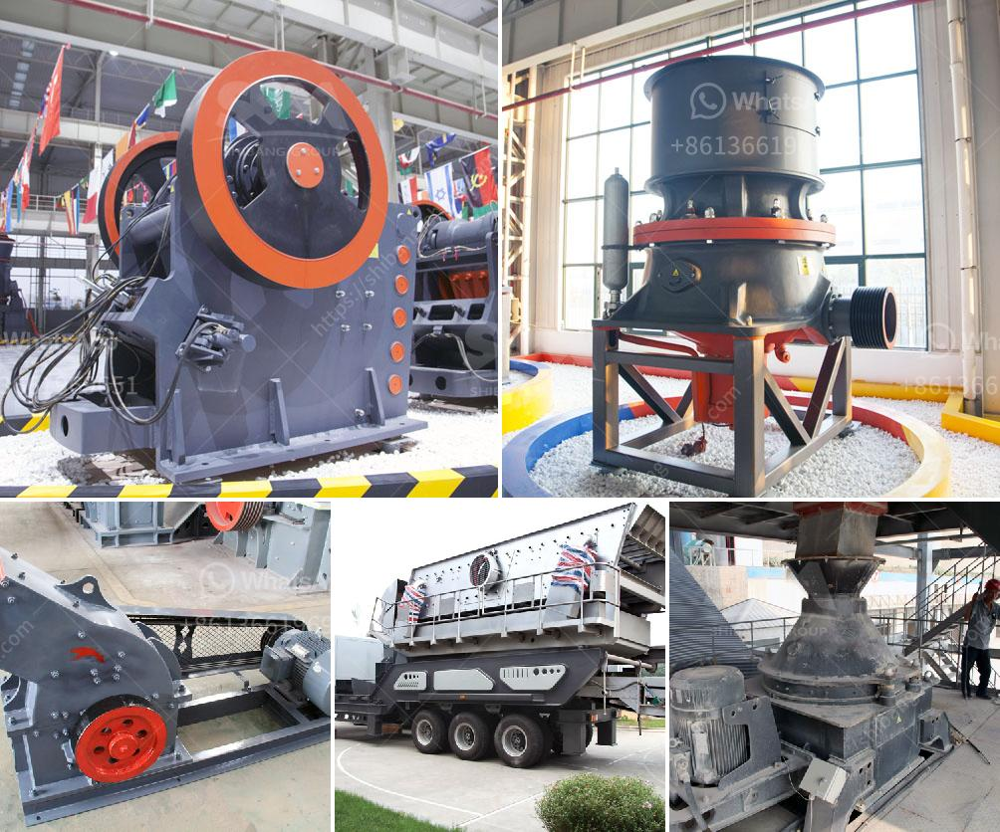

<h3>how to make a vibrating screen for sale</h3>
A vibrating screen is a essential piece of equipment that is used to separate particles, liquids and chemicals into various sizes. They are widely used in industries ranging from mining and construction to pharmaceuticals and food processing. If you are looking to start a business in the screening industry or simply want to make your own vibrating screen for personal use, this article will guide you through the process.

Before starting the construction of a vibrating screen, it is important to determine the purpose for which it will be used. Whether you aim to sell the vibrating screen or use it for personal needs, understanding the target application is crucial. This will help you identify the required size, specifications, and materials needed for construction.

To construct a vibrating screen, you will need materials such as steel, mesh wire, angle iron, vibration motors, and welding equipment. These materials can be easily sourced from local hardware stores or online suppliers. Ensure that the materials are durable and of high quality to ensure the longevity of the vibrating screen.

Next, create a design and layout for your vibrating screen. Consider the dimensions, including length, width, and height, based on your target application. The design should also account for the size and placement of the mesh wire, supporting structure, and vibration motors. Sketch or use computer-aided design software to visualize the final product.

Once you have the design and layout ready, start by welding the supporting structure using angle iron. Ensure that the frame is sturdy and well-aligned to provide a stable base. Proceed to attach the mesh wire securely to the frame using appropriate fasteners. It is essential to stretch the mesh wire uniformly across the screen to ensure consistent particle separation.

To create the vibrating motion, mount vibration motors on the sides of the screen. These can be easily attached to the frame using bolts and nuts. Choose vibration motors that provide the desired oscillation amplitude and frequency for your specific application. Consider consulting a professional or referring to motor specification sheets to ensure accurate motor selection.

Once the vibrating screen is assembled, conduct tests to ensure its functionality and efficiency. Turn on the motors and observe the vibration pattern and performance. Make any necessary adjustments to the motor settings or screen tension to optimize the screening process. Test the screen with different materials and monitor the particle separation to ensure consistent results.

If your intention is to sell the vibrating screen, focus on marketing and sales strategies to reach potential customers. Create a compelling product description, highlighting the screen's features, durability, and benefits over competitors. Leverage online platforms, trade shows, and direct marketing techniques to promote your product to the target audience.

In conclusion, making a vibrating screen for sale can be a rewarding venture if done right. By determining the purpose, gathering the necessary materials, designing and welding the structure, selecting and installing the appropriate vibration motors, and thoroughly testing the equipment, you can create a high-quality vibrating screen. Ensure that you follow safety precautions during the construction process and consult professionals if needed. With a well-designed and functional vibrating screen, you can cater to various industries and achieve success in the screening business.
<h3>Contact us</h3><ul><li><strong>Whatsapp:&nbsp;<a href="https://wa.me/8613661969651">+8613661969651</a></strong></li><li><a href="https://swt.shibang-china.com/?git&amp;zhl&amp;how to make a vibrating screen for sale"><strong>Online Service(chat now)</strong></a></li></ul><h3>Related</h3><ul><li><a href='crushing pe jaw crusher.md'>crushing pe jaw crusher</a></li><li><a href='suoer fine mill grinder.md'>suoer fine mill grinder</a></li><li><a href='crusher for sale in malaysia.md'>crusher for sale in malaysia</a></li><li><a href='industrial hammer mill malaysia.md'>industrial hammer mill malaysia</a></li><li><a href='conveyor belts manufactures.md'>conveyor belts manufactures</a></li></ul>