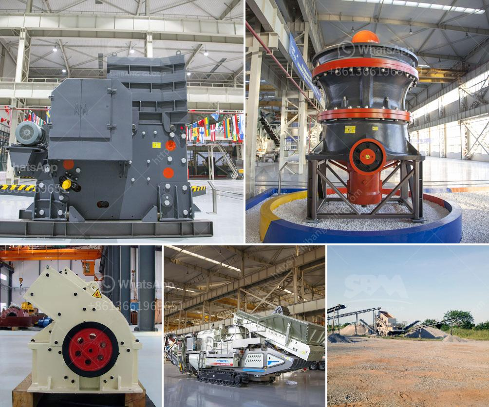

<h3>how to make ganpati with marble powdee</h3>
Ganpati, also known as Lord Ganesha, is one of the most revered and beloved deities in Hinduism. Every year, during the festival of Ganesh Chaturthi, devotees come together to celebrate his birth. Many people create beautiful idols of Lord Ganesha to worship during this auspicious time. While traditionally made idols are crafted from clay, there are alternative methods that can be equally stunning and eco-friendly. One such method is creating a Ganpati idol using marble powder. In this article, we will explore step-by-step instructions on how to make a Ganpati idol with marble powder.

1. Marble powder: You can easily find marble powder in the market. Ensure it is of good quality and finely ground.

- Use acrylic colors to bring life to the idol. Choose vibrant and auspicious colors to enhance the overall appearance.

Congratulations! You have successfully created a beautiful Ganpati idol using marble powder. Place the idol in your home temple or community pandal during Ganesh Chaturthi and offer your prayers with devotion.

Remember, making a Ganpati idol with marble powder is not only a creative endeavor but also an eco-friendly choice. By utilizing materials like marble powder, we contribute to reducing the environmental impact associated with traditional methods. Embrace this unique way of crafting a Ganpati idol and experience the joy of worshiping Lord Ganesha during the auspicious festival of Ganesh Chaturthi.
<h3>Contact us</h3><ul><li><strong>Whatsapp:&nbsp;<a href="https://wa.me/8613661969651">+8613661969651</a></strong></li><li><a href="https://swt.shibang-china.com/?git&amp;zhl&amp;how to make ganpati with marble powdee"><strong>Online Service(chat now)</strong></a></li></ul><h3>Related</h3><ul><li><a href='crusher machine in europe.md'>crusher machine in europe</a></li><li><a href='50 tph raymond mills.md'>50 tph raymond mills</a></li><li><a href='stone crusher equipment supplier.md'>stone crusher equipment supplier</a></li><li><a href='iron ore beneficiation process flow chart.md'>iron ore beneficiation process flow chart</a></li><li><a href='gypsum processing machine suppliers.md'>gypsum processing machine suppliers</a></li></ul>