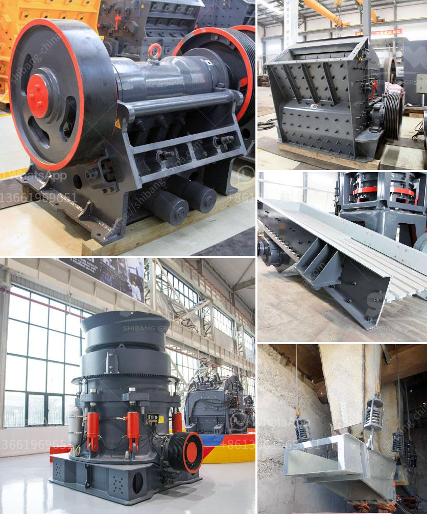

<h3>how to make good with limestone powder</h3>
Limestone is a versatile and popular material used in various construction and industrial applications. It is mostly known for its use as a building material, but limestone powder, a finely ground form of limestone, has equally beneficial properties. Limestone powder is produced by finely grinding limestone and can be used in a variety of applications, ranging from agricultural fertilizers to construction materials. In this article, we will explore some effective ways to make good use of limestone powder in your projects.

Limestone powder can be used for soil stabilization. It is often added to clay and other unstable soils to improve their strength and stability. The high calcium content in limestone powder reacts with clay particles, reducing swelling and preventing soil movement. This application is particularly beneficial in road construction, where soil stabilization is essential for durability and longevity.

Limestone powder can be an excellent replacement for a portion of cement in concrete production. Substituting cement with limestone powder not only reduces the environmental impact but also enhances the workability and strength of concrete. It fills the voids between cement particles, resulting in denser and more cohesive concrete.

Mixing limestone powder with asphalt can improve its performance and durability. Limestone powder acts as a filler that enhances the cohesive properties of asphalt, preventing cracks and potholes. It also reduces the amount of asphalt needed for paving while maintaining structural integrity.

Limestone powder can be used in the production of various building materials. It is commonly used as a filler in paints, ceramics, caulks, and adhesives. The fine particles of limestone powder enhance the consistency and increase the volume of these materials without compromising their quality.

Limestone powder is an excellent source of calcium carbonate. It can be used as a soil amendment to neutralize acidic soils and provide essential nutrients to plants. Incorporating limestone powder into agricultural fertilizers helps improve soil pH, enhances plant growth, and increases crop yield.

Adding limestone powder to animal feed can have numerous benefits. It provides a good source of calcium, which is essential for bone development and eggshell production in poultry. Additionally, limestone powder acts as a pH buffer in the digestive system, aiding in digestion and improving overall animal health.

Limestone powder can be used to mitigate environmental pollution. It can be added to ponds and lakes to reduce the acidity caused by acid rain, creating a more hospitable environment for aquatic life. Limestone powder is also used in flue gas desulfurization, a process that removes sulfur dioxide emissions from power plant exhausts, reducing air pollution.

In conclusion, limestone powder is a valuable resource with diverse applications in various industries. Its versatility extends from construction materials to agricultural fertilizers and environmental remediation. By making good use of limestone powder, we can enhance the quality and sustainability of our projects while minimizing environmental impact. Whether you are involved in construction, agriculture, or any other industry, exploring the possibilities of limestone powder can be a wise decision that brings numerous benefits to your projects.
<h3>Contact us</h3><ul><li><strong>Whatsapp:&nbsp;<a href="https://wa.me/8613661969651">+8613661969651</a></strong></li><li><a href="https://swt.shibang-china.com/?git&amp;zhl&amp;how to make good with limestone powder"><strong>Online Service(chat now)</strong></a></li></ul><h3>Related</h3><ul><li><a href='price of crushers of gravel.md'>price of crushers of gravel</a></li><li><a href='grinding mills ata.md'>grinding mills ata</a></li><li><a href='industrial grinder machine south africa.md'>industrial grinder machine south africa</a></li><li><a href='used mobile stone crushers for sale.md'>used mobile stone crushers for sale</a></li><li><a href='screening and crushing solutions.md'>screening and crushing solutions</a></li></ul>