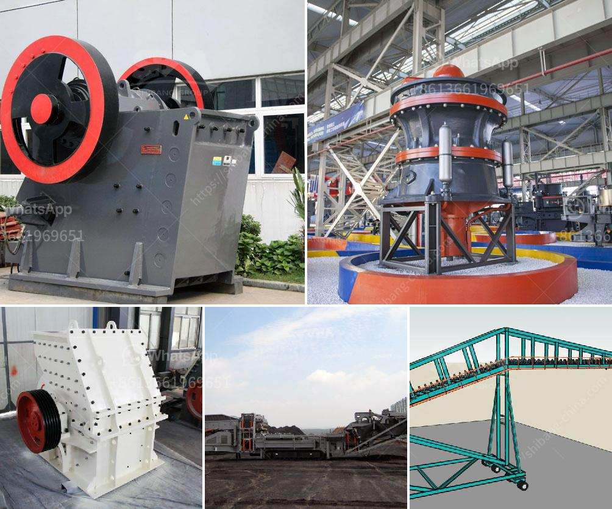

<h3>how to make lime powder</h3>
Lime powder, also known as hydrated lime or calcium hydroxide, is often used in various industries as a chemical compound. It has multiple applications, from agriculture and construction to water treatment and even food preparation. While it is readily available in stores, making lime powder at home can be a cost-effective option, especially if you need it in smaller quantities. Here is a simple guide on how to make lime powder at home.

First, gather the necessary materials which include quicklime (calcium oxide) and water. Quicklime is usually available at hardware or home improvement stores. Make sure to take proper precautions when handling quicklime, such as wearing gloves and goggles, as it is caustic and can cause chemical burns.

Next, prepare a container for the process. A plastic or glass container with a lid should work fine. Ensure that the container is clean and dry before proceeding.

Take the quicklime and add it to the container. The amount of quicklime needed will depend on the desired quantity of lime powder. Start with a small amount if you are unsure about the exact quantity needed.

Now, slowly add water to the container, making sure to mix well. The water will react with the quicklime, causing it to turn into calcium hydroxide or lime powder. Be cautious as the reaction can produce heat, and the mixture may bubble or release steam.

Continuously stir the mixture until it reaches a smooth consistency. The lime powder should be thick and pasty, easy to spread or dissolve when needed.

Once the desired consistency is achieved, let the mixture sit for a while. This will allow any remaining quicklime to fully react and convert into lime powder.

Finally, transfer the lime powder into a clean, dry container with a secure lid. Ensure that the container is properly labelled with the contents and date to avoid confusion in the future.

Remember to store lime powder in a cool, dry place, away from direct sunlight or moisture, as it can affect its quality and usability.

In summary, making lime powder at home is a relatively simple process. By following these steps and taking necessary precautions, you can create lime powder for various applications. However, it is important to note that the quality and purity of homemade lime powder may not be on par with commercially available options. So, if precision and quality are crucial, it may be best to purchase lime powder from a reputable supplier.
<h3>Contact us</h3><ul><li><strong>Whatsapp:&nbsp;<a href="https://wa.me/8613661969651">+8613661969651</a></strong></li><li><a href="https://swt.shibang-china.com/?git&amp;zhl&amp;how to make lime powder"><strong>Online Service(chat now)</strong></a></li></ul><h3>Related</h3><ul><li><a href='stone crusher for rent.md'>stone crusher for rent</a></li><li><a href='small portable crusher for laboratory purpose in india.md'>small portable crusher for laboratory purpose in india</a></li><li><a href='kenya granite stone crushing plant.md'>kenya granite stone crushing plant</a></li><li><a href='roll crusher reduction ratio.md'>roll crusher reduction ratio</a></li><li><a href='quarry small crusher machine for sale in zimbabwe.md'>quarry small crusher machine for sale in zimbabwe</a></li></ul>