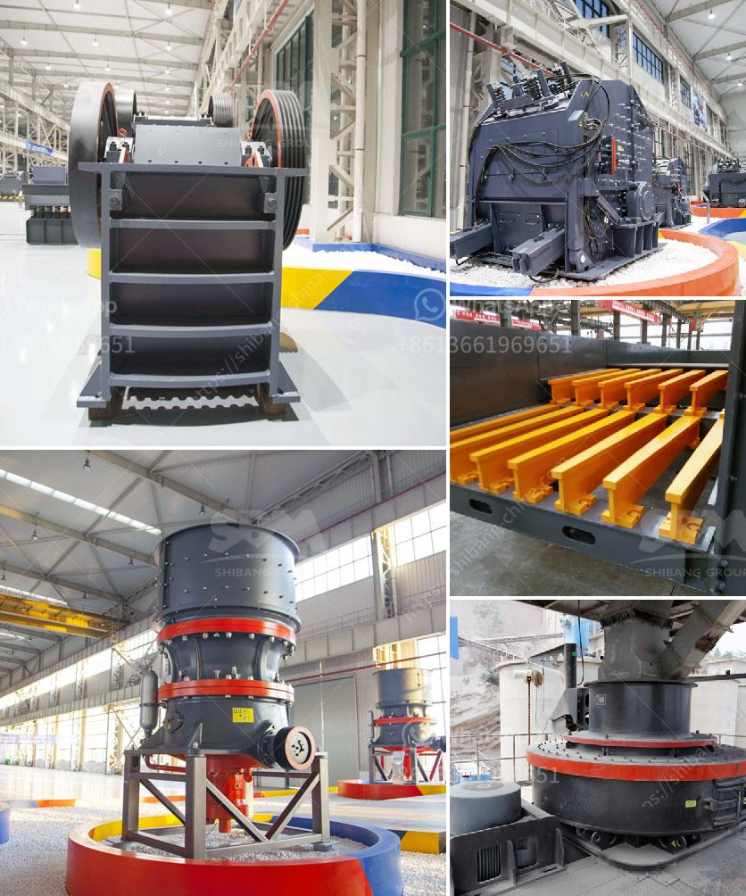

<h3>how to set up a crushing plant</h3>
Setting up a crushing plant involves multiple tasks, such as selecting the right location and machinery, designing the layout, and establishing a budget. With careful planning and attention to detail, the process of setting up a crushing plant can be both time-efficient and cost-effective.

Firstly, choosing the right location is crucial for the success of the crushing plant. Factors to consider include the proximity to raw materials, availability of utilities such as electricity and water, and any environmental regulations in the area. It is also important to assess the accessibility of the location for transporting materials and finished products.

Once the location is determined, selecting the appropriate machinery is the next step. This includes choosing the right type of crusher, screen, conveyor, and other relevant equipment. The machinery should be capable of handling the desired capacity and specifications of the final product. It is advisable to consult with experts or manufacturers to ensure that the selected machinery meets the specific needs of the project.

Designing an efficient layout is crucial for maximizing productivity and ensuring smooth operation. This includes arranging the machinery in a logical sequence, maintaining a proper flow of materials, and optimizing space utilization. Safety measures should also be incorporated into the design to protect workers and equipment.

Setting a budget is essential to keep the project on track. This includes estimating the costs of acquiring machinery, hiring labor, obtaining necessary permits, and any ongoing maintenance expenses. It is important to factor in all potential expenses to avoid unexpected financial setbacks during the setup and operation of the crushing plant.

Overall, setting up a crushing plant requires careful planning and consideration of various factors. By choosing the right location, selecting appropriate machinery, designing an efficient layout, and establishing a realistic budget, the process can be streamlined and successful. Proper execution is key to ensuring the plant operates smoothly, ultimately leading to increased productivity and profitability.
<h3>Contact us</h3><ul><li><strong>Whatsapp:&nbsp;<a href="https://wa.me/8613661969651">+8613661969651</a></strong></li><li><a href="https://swt.shibang-china.com/?git&amp;zhl&amp;how to set up a crushing plant"><strong>Online Service(chat now)</strong></a></li></ul><h3>Related</h3><ul><li><a href='roller mill for gravel.md'>roller mill for gravel</a></li><li><a href='grinding raymond mill.md'>grinding raymond mill</a></li><li><a href='industrial rotary dryers for sale india.md'>industrial rotary dryers for sale india</a></li><li><a href='gold ore ball mill output tph.md'>gold ore ball mill output tph</a></li><li><a href='mineral beneficiation screening ppt.md'>mineral beneficiation screening ppt</a></li></ul>