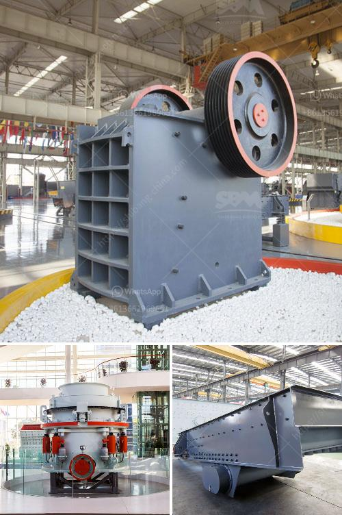

<h3>how to setting up of stone crusher unit</h3>
The process of setting up a stone crusher unit is a complex task, as it involves a number of steps and processes. It requires skilled labor and dedicated team to carry out the task effectively. As the stone crushers are hefty machinery, it is essential to have a proper set up to ensure the smooth functioning and efficient performance of the unit.

Before starting the work, it is important to obtain all the necessary permissions and licenses from the concerned authorities. These permissions include obtaining clearance from the local governing body, pollution control board, and land ownership authorities.

Finding an appropriate location for setting up the stone crusher unit is crucial. The location should be easily accessible and situated close to the source of raw materials like stone mines, river bed, or mountains. It is important to consider factors like availability of transportation facilities, proximity to markets, and environmental factors while selecting the location.

Once the location is finalized, it is important to procure the necessary equipment and machinery required for the stone crusher unit. This includes crushers, conveyors, screening equipment, and other auxiliary equipment. It is important to choose the equipment based on the type of stones to be crushed and the required output capacity.

Setting up a stone crusher unit requires skilled labor and experts who have experience in handling similar projects. It is important to arrange for skilled operators, technicians, and engineers who can handle the machinery efficiently and ensure smooth operation.

Constructing the necessary infrastructure is an important step in setting up a stone crusher unit. This includes building a shed or enclosure to house the machinery, providing electricity supply, water facilities, and setting up other ancillary facilities like offices, storehouses, and workshops.

Once the stone crusher unit is set up and all the necessary arrangements are made, it is important to start the operations as per the planned schedule. Regular monitoring and maintenance of the machinery is crucial to ensure efficient performance. It is important to keep a check on operational parameters like crushing capacity, power consumption, and production quality.

In conclusion, setting up a stone crusher unit requires careful planning, execution, and monitoring. It is important to follow the necessary legal and environmental requirements and ensure the availability of skilled labor and necessary equipment. By following these steps effectively, one can set up a successful stone crusher unit that can cater to the growing demand for construction materials.
<h3>Contact us</h3><ul><li><strong>Whatsapp:&nbsp;<a href="https://wa.me/8613661969651">+8613661969651</a></strong></li><li><a href="https://swt.shibang-china.com/?git&amp;zhl&amp;how to setting up of stone crusher unit"><strong>Online Service(chat now)</strong></a></li></ul><h3>Related</h3><ul><li><a href='second hand mobile crusher plant in india.md'>second hand mobile crusher plant in india</a></li><li><a href='crusher business for sale in oman.md'>crusher business for sale in oman</a></li><li><a href='size and capasity typical jaw crusher.md'>size and capasity typical jaw crusher</a></li><li><a href='granite aggregate quarry machinary for sale.md'>granite aggregate quarry machinary for sale</a></li><li><a href='stone crusher jaw 40 ton jam harga.md'>stone crusher jaw 40 ton jam harga</a></li></ul>