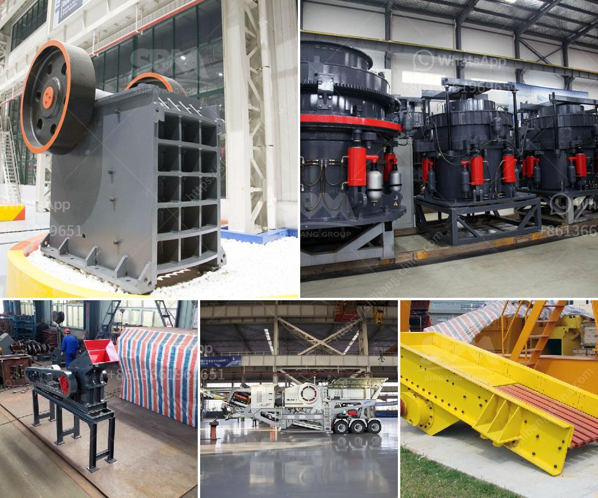

<h3>how to setup the manganese ore processing plant</h3>
Manganese is an essential mineral used in various industrial applications, particularly in the production of steel and batteries. To meet the growing demand for this valuable resource, setting up a manganese ore processing plant can be a lucrative venture. Here are some key steps in the setup process:

1. Site selection: Choose a suitable location for the plant, considering factors such as proximity to manganese ore deposits, availability of necessary infrastructure, and environmental regulations.

2. Obtain permits and licenses: Ensure compliance with all legal requirements and obtain the necessary permits and licenses for setting up and operating the processing plant.

3. Procure equipment: Source and acquire the required processing equipment based on the desired capacity of the plant. Equipment may include crushers, screens, magnetic separators, and gravity separators, among others.

4. Ore beneficiation: Manganese ore generally needs beneficiation to remove impurities and improve its quality. Common beneficiation methods include crushing, screening, washing, and magnetic separation.

5. Crushing and screening: Crush the mined manganese ore into smaller sizes for further processing. Use a combination of crushers and screens to achieve the desired size range.

6. Washing: Clean the crushed ore through a series of washers to remove impurities such as clay, mud, and organic matter. This step helps improve the ore's quality and reduce the impurities that may affect the subsequent processing stages.

7. Magnetic separation: Use magnetic separators to remove magnetic impurities from the ore. This process is crucial in achieving a high-grade manganese concentrate.

8. Gravity separation: Utilize gravity separation techniques to separate the lighter gangue minerals from the heavier manganese ore particles. This step helps in obtaining a concentrated manganese product.

9. Drying and packaging: Dry the final product to reduce moisture content, and package it for storage or transportation to the end-user.

10. Quality control: Implement proper quality control measures throughout the processing plant to ensure consistency and meet customer specifications. This includes regular sampling, analysis, and adherence to quality standards.

Proper planning, efficient processes, and adherence to environmental and safety regulations are vital for the successful setup and operation of a manganese ore processing plant. With careful consideration and effective implementation of the aforementioned steps, you can establish a profitable and sustainable manganese ore processing facility.
<h3>Contact us</h3><ul><li><strong>Whatsapp:&nbsp;<a href="https://wa.me/8613661969651">+8613661969651</a></strong></li><li><a href="https://swt.shibang-china.com/?git&amp;zhl&amp;how to setup the manganese ore processing plant"><strong>Online Service(chat now)</strong></a></li></ul><h3>Related</h3><ul><li><a href='stone crushing industry in malaysia.md'>stone crushing industry in malaysia</a></li><li><a href='stone crusher pe 250x400.md'>stone crusher pe 250x400</a></li><li><a href='primary impact crusher disadvantages.md'>primary impact crusher disadvantages</a></li><li><a href='iron ore beneficiation plant consultants in india.md'>iron ore beneficiation plant consultants in india</a></li><li><a href='mobile sand washing machine.md'>mobile sand washing machine</a></li></ul>