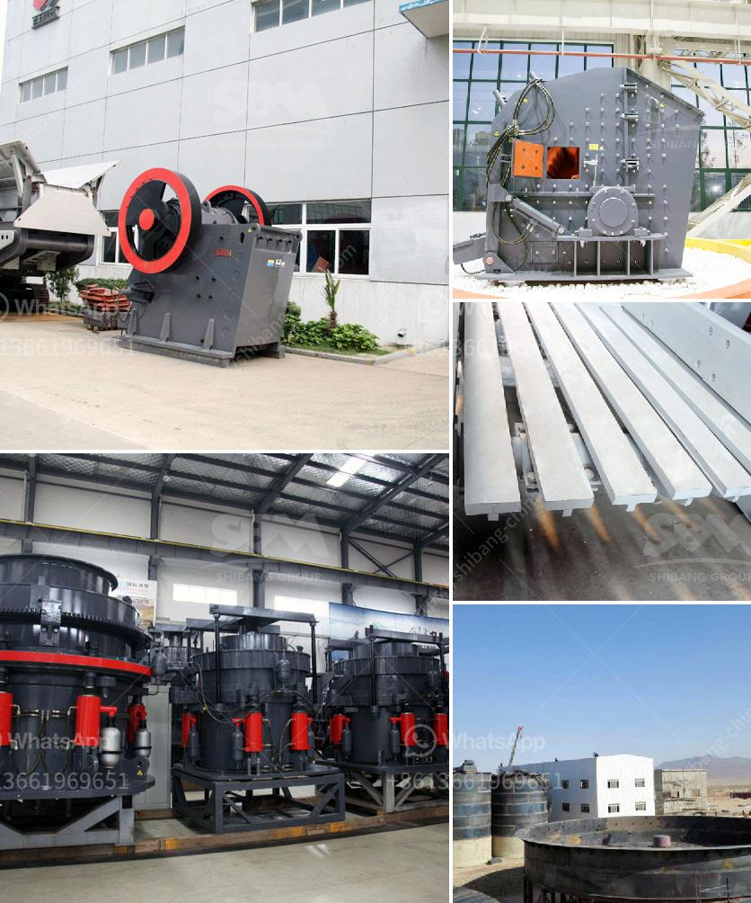

<h3>how to specify a jaw crusher</h3>
A jaw crusher is a vital piece of equipment in many industries, including mining, construction, and recycling. It allows the crushing of materials to be conducted with ease and efficiency. However, not all jaw crushers are created equal, and it's important to understand how to specify a crusher that suits your needs.

1. Determine your material and capacity requirements: Begin by assessing the type of material you will be crushing. Is it hard or soft? Is it abrasive or non-abrasive? Additionally, evaluate your expected production capacity needs. Will you be processing a high volume of material or a lower volume? Understanding these factors will help you determine the ideal jaw crusher for your application.

2. Consider the size and capacity: Jaw crushers come in different sizes, and it's essential to select the appropriate size based on the feed material size and the desired discharge size. The feed opening size represents the dimension of the top of the jaws, and the discharge opening size indicates the output size of the crushed material. A larger feed opening allows for larger feeding sizes, which can be beneficial when processing larger rocks or hard materials. However, a smaller discharge opening size can yield a finer product.

3. Evaluate the power requirements: Jaw crushers require sufficient power to handle the crushing process effectively. Specifying the appropriate power capacity ensures that the crusher can operate efficiently without overheating or experiencing any performance issues. Consider factors like the feed size, type of material, and required reduction ratio to estimate the power requirements accurately.

4. Analyze the operational and maintenance aspects: It's crucial to evaluate the operating conditions and maintenance requirements of the jaw crusher. Consider factors such as how often the crusher will be operated, what kind of maintenance will be needed, and the availability of spare parts and skilled personnel. A jaw crusher with a robust design and easy access to critical components will simplify maintenance and promote longer service life.

5. Research reputable manufacturers: To ensure that you get a high-quality jaw crusher, research and identify reputable manufacturers or suppliers. Look for manufacturers with a proven track record in producing reliable and durable crushers. Consider their experience in the industry, customer reviews, and the availability of technical support and after-sales service.

6. Engage with an expert: If you are uncertain about the specifications or requirements for your jaw crusher, consider engaging with an expert or consultant. They can provide guidance and offer insights regarding your specific needs. Their technical knowledge and expertise can be instrumental in specifying the correct crusher for your application.

In conclusion, specifying a jaw crusher involves considering various factors such as material and capacity requirements, size and capacity, power requirements, operational and maintenance aspects, and the reputation of the manufacturer. Taking the time to consider these factors will help you select the most suitable jaw crusher for your specific application, ensuring optimal performance and productivity.
<h3>Contact us</h3><ul><li><strong>Whatsapp:&nbsp;<a href="https://wa.me/8613661969651">+8613661969651</a></strong></li><li><a href="https://swt.shibang-china.com/?git&amp;zhl&amp;how to specify a jaw crusher"><strong>Online Service(chat now)</strong></a></li></ul><h3>Related</h3><ul><li><a href='mining equipment seller in asia.md'>mining equipment seller in asia</a></li><li><a href='list of machineries for marble processing plants.md'>list of machineries for marble processing plants</a></li><li><a href='how to set up a crushing plant.md'>how to set up a crushing plant</a></li><li><a href='jaw crusher for sale in harare.md'>jaw crusher for sale in harare</a></li><li><a href='prices for ball mill in south africa.md'>prices for ball mill in south africa</a></li></ul>