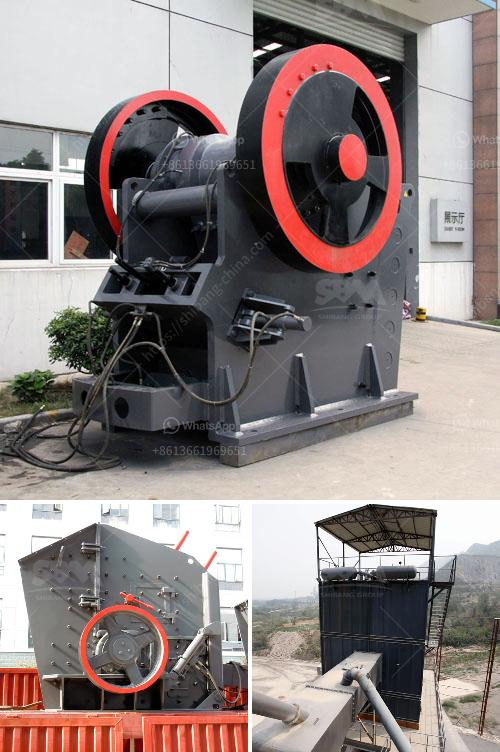

<h3>how to start mining business in india</h3>
India, being rich in mineral resources, offers a lucrative potential for those aspiring to venture into the mining industry. With a growing demand for minerals both domestically and internationally, starting a mining business in India can be a highly rewarding endeavor. This article aims to provide a concise guide on how to kickstart a mining venture in India, particularly for those with limited capital ranging from 100 to 300 words.

The first step is to conduct thorough research and identify the minerals you wish to mine based on their demand and availability in the market. Whether it's coal, iron ore, limestone, or rare-earth minerals, understanding the industry dynamics and choosing the right mineral greatly influences your chances of success.

Securing the necessary licenses, permits, and approvals is imperative before commencing any mining operations. Apply for the appropriate mining lease and register your business with relevant authorities like the Ministry of Mines and State Mining Departments. Comply with legal requirements, environmental regulations, and safety standards imposed by both national and state-level agencies.

Develop a comprehensive business plan that outlines your investment, operational strategies, market analysis, financial projections, and risk management strategies. This will be crucial when approaching potential investors, financial institutions, or seeking government assistance programs offered to entrepreneurs in the mining sector.

Mining operations require substantial financial investments. Explore various funding options such as bank loans, venture capital funds, private equity investments, or crowdfunding platforms. Leverage your detailed business plan to convince potential investors or lenders about the profitability and viability of your mining venture.

Invest in suitable mining equipment and machinery based on the nature of your chosen mineral. Partnering with reputable suppliers and manufacturers will ensure efficiency and durability of equipment over time. Additionally, hiring skilled labor and technicians familiar with mining operations will also be essential.

Establishing a robust supply chain network should be a priority. Forge partnerships with local suppliers, distributors, and transporters to ensure the smooth movement of minerals from the mining site to your designated market destinations. A strong supply chain will mitigate bottlenecks and reduce time and cost inefficiencies.

Aspiring entrepreneurs interested in venturing into the mining industry in India can tap into the immense potential it offers. However, due diligence in terms of research, licenses, and adequate funding is essential. Carefully crafting a comprehensive business plan and establishing a robust supply chain will also be crucial. With the right knowledge, strategy, and determination, starting a mining business in India can pave the way for significant profits and long-term success.
<h3>Contact us</h3><ul><li><strong>Whatsapp:&nbsp;<a href="https://wa.me/8613661969651">+8613661969651</a></strong></li><li><a href="https://swt.shibang-china.com/?git&amp;zhl&amp;how to start mining business in india"><strong>Online Service(chat now)</strong></a></li></ul><h3>Related</h3><ul><li><a href='conveyor belts in south africa.md'>conveyor belts in south africa</a></li><li><a href='harga mobile crusher in indonesia.md'>harga mobile crusher in indonesia</a></li><li><a href='how to make ganpati with marble powdee.md'>how to make ganpati with marble powdee</a></li><li><a href='copper crusher pressure gauge manufacturer.md'>copper crusher pressure gauge manufacturer</a></li><li><a href='stone pickers machine in india.md'>stone pickers machine in india</a></li></ul>