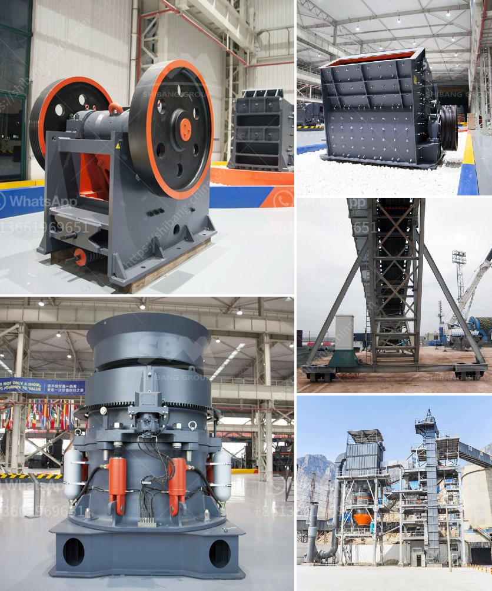

<h3>how to start quarry business</h3>
Are you interested in starting a quarry business? Quarries can be a profitable and long-lasting business venture, especially if you have access to a large and steady supply of materials. If you're planning to open a quarry, you'll need the right tools, resources, and funding to get started. Starting a quarry business requires a good knowledge of the market, positive attitude, and a good business plan.

Before we can start quarrying, we need to get a good understanding of how quarries operate and what factors need to be taken into consideration. Quarries are essentially large holes in the ground that are created by extracting minerals or other valuable resources. The materials extracted from quarries are used for a variety of purposes, such as construction materials, landscaping, and road surfacing. They can be classified into two categories: dimension stones and aggregate stones.

To start a quarry business, you need sufficient expertise and an understanding of the industry. This includes acquiring knowledge about the different types of stones found in quarries, the equipment required to extract these stones, and the markets where the materials can be sold. The next step is to identify the location and size of the quarry. Ideally, the quarry should be situated in an area with a large deposit of stones, ample space for excavating, and easy transportation access.

Once you have identified a suitable location for your quarry, it’s important to secure the necessary permits and licenses required to operate the business legally. The specific requirements vary depending on your country and region, so it's best to consult with local authorities or experts in the field. These permits and licenses ensure that you comply with environmental regulations, safety measures, and other legal obligations.

Financial considerations are also crucial when starting a quarry business. Costs include acquiring land, mining equipment, building infrastructure, and initial expenses like setting up utilities and obtaining a bank loan. To secure funding, you may need to have a well-drafted business plan that demonstrates the profitability and potential growth of the quarry. This business plan should also include a marketing and sales strategy, outlining how you will attract customers and generate revenue.

To operate a successful quarry business, you'll also need a dedicated team to handle operations. This includes hiring skilled workers, such as machine operators, mechanics, and administrative staff. Additionally, ongoing maintenance, periodic inspections, and proper record-keeping are essential to ensure the quarry operates smoothly and meets all safety standards.

In conclusion, starting a quarry business is a significant undertaking that requires meticulous planning, precise execution, and unwavering dedication. In-depth knowledge of the industry, a well-drafted business plan, and a team of skilled professionals are crucial to ensure success. While the initial financial commitment may be substantial, the quarry business can be highly profitable and provide a valuable resource to the construction industry.
<h3>Contact us</h3><ul><li><strong>Whatsapp:&nbsp;<a href="https://wa.me/8613661969651">+8613661969651</a></strong></li><li><a href="https://swt.shibang-china.com/?git&amp;zhl&amp;how to start quarry business"><strong>Online Service(chat now)</strong></a></li></ul><h3>Related</h3><ul><li><a href='iron ore mines cost structure.md'>iron ore mines cost structure</a></li><li><a href='quartz powder making machine.md'>quartz powder making machine</a></li><li><a href='price list of stone crusher in india.md'>price list of stone crusher in india</a></li><li><a href='old impact crushing plant for sale.md'>old impact crushing plant for sale</a></li><li><a href='crusher operator salary in uae and dubai.md'>crusher operator salary in uae and dubai</a></li></ul>