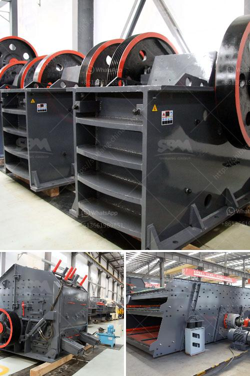

<h3>hydraulic driven track mobile plant</h3>
Hydraulic driven track mobile plant, also known as crawler mobile crusher, is a versatile and efficient type of mobile crushing equipment. It is designed to deliver excellent crushing performance in various demanding environments and conditions.

The track mobile plant has an advanced hydraulic system which provides the user with great flexibility in terms of the movement and operation of the equipment. The hydraulic system allows for easy and smooth adjustment of the crusher settings, as well as quick and convenient transportation and relocation of the plant.

One of the key advantages of the hydraulic driven track mobile plant is its outstanding mobility. This mobile crusher can be easily transported to different job sites, reducing the need for additional transportation equipment. It can also be quickly set up and dismantled, making it ideal for projects with tight schedules and frequent relocation.

Another notable feature of this mobile crushing plant is its high performance and efficiency. The hydraulic driven track mobile plant is equipped with a powerful and fuel-efficient engine, which provides constant and reliable power to the crushing equipment. This enables the plant to handle various types of materials, including hard and abrasive ones, with ease.

The hydraulic driven track mobile plant is also designed with user safety in mind. It is equipped with advanced safety features, such as a remote control system, which allows for safe and easy operation of the crusher from a distance. It also has integrated safety guards and emergency stop buttons to prevent accidents and ensure the well-being of operators.

In conclusion, the hydraulic driven track mobile plant is a versatile and efficient mobile crushing equipment that offers excellent performance, mobility, and safety. With its advanced hydraulic system and user-friendly features, it is an ideal choice for various crushing applications in construction, mining, and recycling industries.
<h3>Contact us</h3><ul><li><strong>Whatsapp:&nbsp;<a href="https://wa.me/8613661969651">+8613661969651</a></strong></li><li><a href="https://swt.shibang-china.com/?git&amp;zhl&amp;hydraulic driven track mobile plant"><strong>Online Service(chat now)</strong></a></li></ul><h3>Related</h3><ul><li><a href='mtw series trapezium mill.md'>mtw series trapezium mill</a></li><li><a href='crusher machinery.md'>crusher machinery</a></li><li><a href='coal crusher rental price list.md'>coal crusher rental price list</a></li><li><a href='jaw industry limestone process.md'>jaw industry limestone process</a></li><li><a href='stone crusher quarry.md'>stone crusher quarry</a></li></ul>