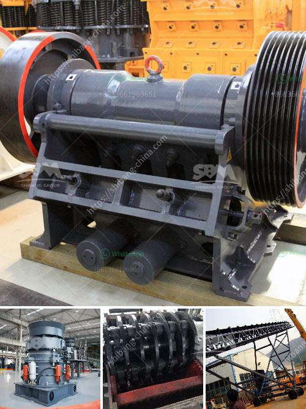

<h3>hydraulic impact crusher</h3>
Hydraulic impact crusher is a type of hydraulic crusher or hydraulic rock crusher used widely in stone crushing lines. This entry was posted in Uncategorized. Bookmark the permalink. « Impact crusher for limestone production line.

When working, the hydraulic impact crusher drives the rotor through the motor. The rotor rotates at a high speed and the material from the feeding inlet collides with each other. Under the strong impact force, the material is crushed into smaller pieces. Upon reaching the required size, the crushed material is discharged through the bottom of the machine.

One of the key features of the hydraulic impact crusher is its powerful and efficient crushing ability. This crushing method allows the machine to crush materials with high hardness, such as granite, limestone, and concrete. The hydraulic impact crusher can produce uniform particle size and shape, which makes it suitable for medium and fine crushing operations.

Another advantage of the hydraulic impact crusher is its adjustable output size. With the hydraulic system, the operator can easily adjust the clearance between the impact plate and the hammer to control the final product size. This feature ensures that the hydraulic impact crusher can meet the different requirements of customers in various industries.

The hydraulic impact crusher is also known for its high production capacity. The rotating rotor and the stationary impact plate generate a large crushing force, which improves the production efficiency of the machine. Besides, the hydraulic system can provide overload protection, which can greatly prevent the equipment from damage due to excessive crushing.

Furthermore, the hydraulic impact crusher is also easy to maintain. The machine is equipped with a hydraulic opening device, which makes it convenient to replace the wearing parts, such as the impact plate and the hammer. This feature saves both time and effort for the maintenance personnel.

In conclusion, the hydraulic impact crusher is a powerful and efficient crushing machine that can crush materials with high hardness and produce uniform particle size and shape. It is widely used in various industries, such as mining, construction, and recycling. With its adjustable output size, high production capacity and easy maintenance, the hydraulic impact crusher has become a popular choice among customers.
<h3>Contact us</h3><ul><li><strong>Whatsapp:&nbsp;<a href="https://wa.me/8613661969651">+8613661969651</a></strong></li><li><a href="https://swt.shibang-china.com/?git&amp;zhl&amp;hydraulic impact crusher"><strong>Online Service(chat now)</strong></a></li></ul><h3>Related</h3><ul><li><a href='price of smallest ballast crusher in kenya.md'>price of smallest ballast crusher in kenya</a></li><li><a href='vertical coal mill manufacturer in china.md'>vertical coal mill manufacturer in china</a></li><li><a href='mining rock quarry crusher for sale.md'>mining rock quarry crusher for sale</a></li><li><a href='mobile crusher machine for sale.md'>mobile crusher machine for sale</a></li><li><a href='crusher machine sri lanka.md'>crusher machine sri lanka</a></li></ul>