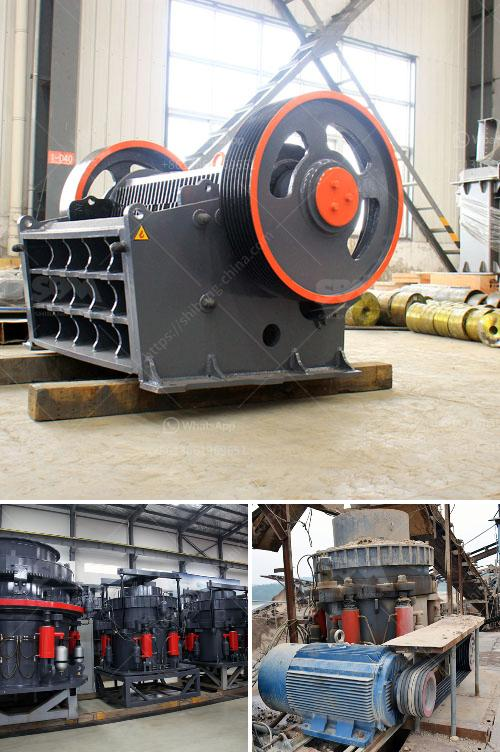

<h3>hydraulic roll crusher zenith</h3>
The hydraulic roll crusher (HRC) from Zenith is a revolutionary and innovative workhorse in the mining and construction industry, offering unparalleled advantages and unique performance characteristics.

The HRC has been designed with a multitude of benefits in mind, including increased efficiency, expanded capacities, reduced energy consumption, and simplified maintenance procedures. This next-generation crusher represents a significant advancement in crushing technology and sets a new standard in the industry.

One of the key features of the HRC is its ability to produce uniform cubic end products with minimal fines generation. This is achieved through the adoption of high-pressure grinding rolls (HPGR) technology. The HPGR system applies a high-pressure force to the feed material, resulting in the efficient comminution of the particles and a reduction in the production of undesirable fines. This ensures that the end product meets strict specifications and is suitable for various applications.

Furthermore, the HRC's design incorporates a hydraulic system that allows for the adjustment of the crushing gap and the control of the crusher's performance. The hydraulic system ensures consistent and precise product size control, regardless of variations in the feed material. This enables operators to optimize the crusher's performance, adapt to changing conditions, and meet specific requirements.

In addition to its exceptional performance, the HRC is also known for its robust construction and durability. The crusher's frame is made of heavy-duty steel, providing a strong foundation for the crushing process and ensuring long-term reliability. The crusher also features a roll assembly made of wear-resistant materials, resulting in extended service life even in challenging operating conditions.

Maintenance is made easy with the HRC's user-friendly design. The crusher's access doors and hinged roll end doors facilitate quick and safe maintenance operations, reducing downtime and increasing productivity. Additionally, the hydraulic system automatically releases any uncrushable material, preventing damage to the crusher and minimizing downtime.

The HRC's compact design also makes it suitable for both stationary and mobile applications. Its versatility allows it to be easily integrated into existing crushing circuits, transforming them into more efficient and productive systems. The compact footprint and low profile of the crusher also make it ideal for underground mining operations, where space is limited.

In conclusion, the hydraulic roll crusher from Zenith is a game-changer in the mining and construction industry. Its innovative design, high-pressure grinding rolls technology, and user-friendly features set it apart from traditional crushers. With increased efficiency, expanded capacities, reduced energy consumption, and simplified maintenance procedures, the HRC offers unmatched performance and superior quality. The HRC is poised to revolutionize the crushing process and contribute to the success of countless mining and construction projects worldwide.
<h3>Contact us</h3><ul><li><strong>Whatsapp:&nbsp;<a href="https://wa.me/8613661969651">+8613661969651</a></strong></li><li><a href="https://swt.shibang-china.com/?git&amp;zhl&amp;hydraulic roll crusher zenith"><strong>Online Service(chat now)</strong></a></li></ul><h3>Related</h3><ul><li><a href='stone crusher machine from japan.md'>stone crusher machine from japan</a></li><li><a href='thailand coconut processing machine.md'>thailand coconut processing machine</a></li><li><a href='how much is ballast crusher machine in kenya.md'>how much is ballast crusher machine in kenya</a></li><li><a href='used stone crusher in uganda.md'>used stone crusher in uganda</a></li><li><a href='manufacturer of barite in pakistan.md'>manufacturer of barite in pakistan</a></li></ul>