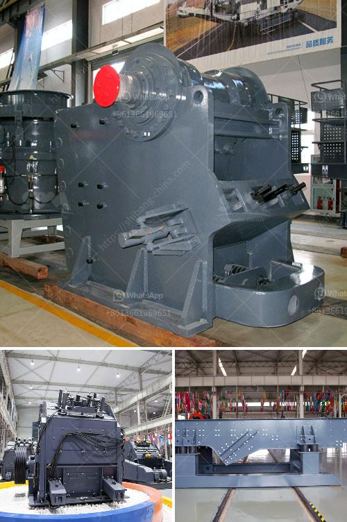

<h3>hydrosizer sand making machine in south africa</h3>
In South Africa, the sand industry has always been a prominent sector due to its vast resources and a wide range of applications. However, the traditional sand processing methods could not fully meet the increasing demands for high-quality sand. This called for a more efficient and effective solution, leading to the development of the hydrosizer sand making machine.

The hydrosizer sand making machine, also known as a hydraulic classifier, embodies a pioneering concept that combines traditional sand washing and mineral processing techniques. As the name suggests, it utilizes water as a medium to wash and separate sand particles, making it a reliable and versatile solution for a variety of sand applications.

One of the key advantages of the hydrosizer machine is its exceptional ability to produce multiple sand products simultaneously. Through a series of precise hydraulic interactions, the machine separates sand particles based on their size and density, resulting in the production of various sand grades with uniform particle size distribution. This feature makes it ideal for applications that require specific sand characteristics, such as construction, foundry, and glass industries.

The hydrosizer machine operates in a closed-loop system, ensuring minimal water consumption and effectively reducing environmental impact. The captured water is recycled within the system, reducing the need for fresh water supply. This not only promotes sustainable operations but also helps companies comply with stringent environmental regulations.

Furthermore, the hydrosizer sand making machine offers exceptional control over the sand production process. By adjusting the water flow and hydraulic settings, operators can fine-tune the separation process to achieve the desired sand grades and quality. This level of control ensures that the produced sand meets the specific requirements of each application, maximizing the value of the final product.

In addition to its functional advantages, the hydrosizer machine also boasts a compact design, making it a space-saving solution for sand processing plants. Its modular construction allows for easy installation and integration into existing production lines, reducing downtime and increasing operational efficiency.

South Africa, with its abundant sand resources, has embraced the hydrosizer sand making machine as a solution to improve productivity and elevate the quality of its sand products. Various industries have already started reaping the benefits of this revolutionary technology, experiencing increased competitiveness and improved customer satisfaction.

In conclusion, the hydrosizer sand making machine has emerged as a game-changer in the South African sand industry. Its ability to produce multiple sand products simultaneously, reduce water consumption, and offer exceptional control over the production process makes it a valuable asset for sand processing plants. As the demand for high-quality sand continues to rise, the hydrosizer machine remains at the forefront, providing a reliable and sustainable solution for the ever-evolving sand industry in South Africa.
<h3>Contact us</h3><ul><li><strong>Whatsapp:&nbsp;<a href="https://wa.me/8613661969651">+8613661969651</a></strong></li><li><a href="https://swt.shibang-china.com/?git&amp;zhl&amp;hydrosizer sand making machine in south africa"><strong>Online Service(chat now)</strong></a></li></ul><h3>Related</h3><ul><li><a href='small scale tin mining design.md'>small scale tin mining design</a></li><li><a href='rock belt conveyor spec.md'>rock belt conveyor spec</a></li><li><a href='looking for limestone crushing contractor.md'>looking for limestone crushing contractor</a></li><li><a href='roller crusher brick making machine.md'>roller crusher brick making machine</a></li><li><a href='ball mills mfg in kenya.md'>ball mills mfg in kenya</a></li></ul>