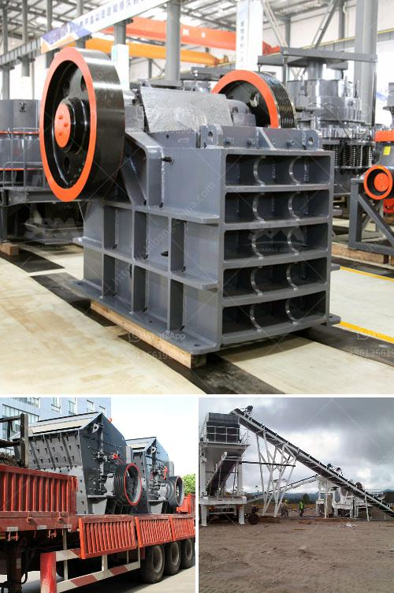

<h3>i want to buy china raymond grinding mill</h3>
Are you looking for an efficient and reliable grinding mill? Look no further because the China Raymond grinding mill is the perfect fit for you. This advanced grinding mill is designed to grind and process more than 280 kinds of non-flammable and non-explosive materials with hardness less than 7 and humidity less than 6% in mining, construction, chemical industry, and metallurgy, just to name a few.

One of the primary features that makes this grinding mill stand out is its high efficiency. The China Raymond grinding mill has a production capacity of more than 6t/h while its energy consumption per unit is low. Therefore, compared with similar products of other manufacturers, this grinding mill can save more than 30% energy. Additionally, the structure of the Raymond grinding mill is tightly sealed, ensuring that no powder can escape during the grinding process. This results in a cleaner and dust-free working environment.

Another advantage of the China Raymond grinding mill is its versatile grinding capabilities. This mill can be used to grind various kinds of materials, including limestone, gypsum, dolomite, barite, calcium carbonate, feldspar, bentonite, kaolin, diabase, marble, and more. Its versatility allows users to adjust the fineness of the final product according to their specific needs.

Furthermore, the China Raymond grinding mill is easy to maintain. The wear parts of the mill are made of high-quality materials, which ensures their durability and long lifespan. In addition, the automatic lubrication system reduces the risk of equipment failure and extends the service life of the bearings.

If you are still hesitant, let me assure you that purchasing a China Raymond grinding mill is a wise investment. With its high efficiency, versatility, and ease of maintenance, this grinding mill will undoubtedly improve your productivity and profitability. Don't miss out on the opportunity to own this exceptional piece of equipment. Place your order now and experience the benefits firsthand!
<h3>Contact us</h3><ul><li><strong>Whatsapp:&nbsp;<a href="https://wa.me/8613661969651">+8613661969651</a></strong></li><li><a href="https://swt.shibang-china.com/?git&amp;zhl&amp;i want to buy china raymond grinding mill"><strong>Online Service(chat now)</strong></a></li></ul><h3>Related</h3><ul><li><a href='grinding plant improvement.md'>grinding plant improvement</a></li><li><a href='coal screen plant for hire in south africa.md'>coal screen plant for hire in south africa</a></li><li><a href='cement factory plant cost.md'>cement factory plant cost</a></li><li><a href='granite aggregate quarry machinary for sale.md'>granite aggregate quarry machinary for sale</a></li><li><a href='stone crusher plant management.md'>stone crusher plant management</a></li></ul>