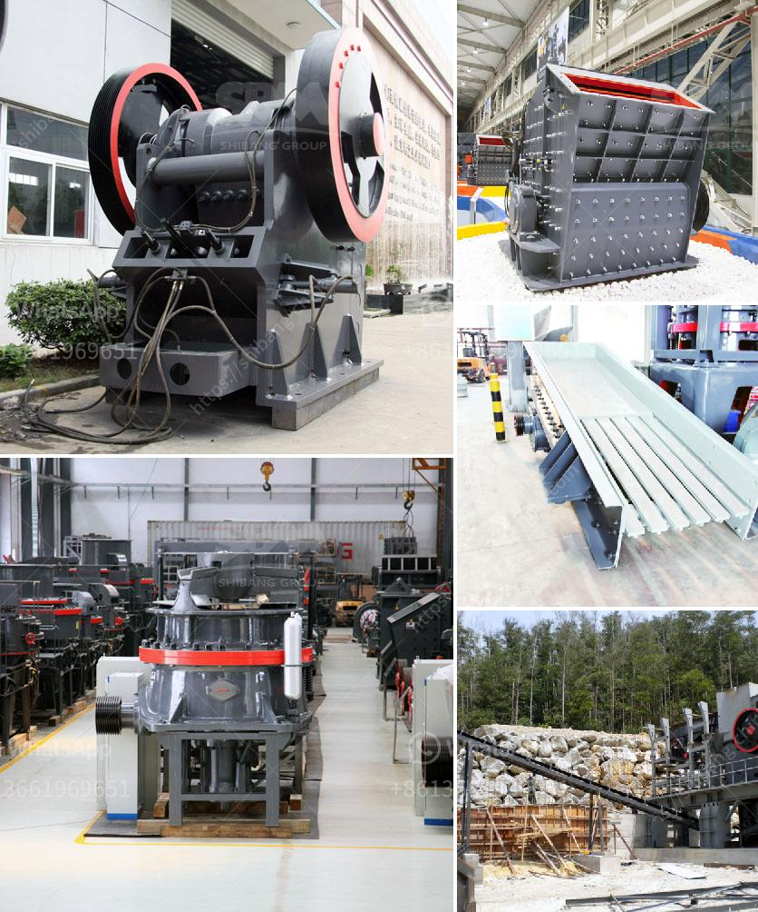

<h3>impact crusher equipment</h3>
The importance of the impact crusher equipment in the aggregate production line is undeniable. As a primary and secondary crusher, the impact crusher is an indispensable piece of equipment for any stone crushing production line. The versatility of the impact crusher makes it a valuable tool for a variety of applications, such as mining, quarrying, and demolition.

One key feature that sets this equipment apart is its ability to work in both primary and secondary crushing modes. This means that the impact crusher can be used to efficiently break down larger materials into smaller ones and further process them into finer particles. As a result, it becomes an ideal choice for reducing the size of materials to meet the specific requirements of various industries.

Another advantage of the impact crusher equipment is its high-performance crushing chamber design. The unique shape of the chamber enables the material to be crushed more efficiently, resulting in a higher reduction ratio. This means that more of the input material is crushed into smaller particles, making it easier to obtain the desired product size. Additionally, the impact crusher's high-speed rotation helps to generate a strong impact force, further enhancing its crushing capacity.

Furthermore, the impact crusher equipment is designed with safety in mind. Its robust construction and advanced features ensure maximum protection for both operators and the machine itself. Features such as hydraulic adjustment and overload protection systems help to prevent any damage that may occur during operation, minimizing downtime and maintenance costs.

In conclusion, the impact crusher equipment is a versatile and indispensable tool in the aggregate production line. Its ability to work in both primary and secondary crushing modes, along with its high-performance crushing chamber design, makes it a valuable asset for a variety of applications. Moreover, its safety features ensure efficient and reliable operation, contributing to overall productivity and profitability. Whether it's reducing the size of hard materials or processing finer particles, the impact crusher is a reliable and efficient solution for crushing operations.
<h3>Contact us</h3><ul><li><strong>Whatsapp:&nbsp;<a href="https://wa.me/8613661969651">+8613661969651</a></strong></li><li><a href="https://swt.shibang-china.com/?git&amp;zhl&amp;impact crusher equipment"><strong>Online Service(chat now)</strong></a></li></ul><h3>Related</h3><ul><li><a href='roller mill diagram.md'>roller mill diagram</a></li><li><a href='different part of barite and bentonite mill.md'>different part of barite and bentonite mill</a></li><li><a href='coal crusher machine indonesia supplier.md'>coal crusher machine indonesia supplier</a></li><li><a href='crushing pe jaw crusher.md'>crushing pe jaw crusher</a></li><li><a href='total process of gypsum powder plant.md'>total process of gypsum powder plant</a></li></ul>