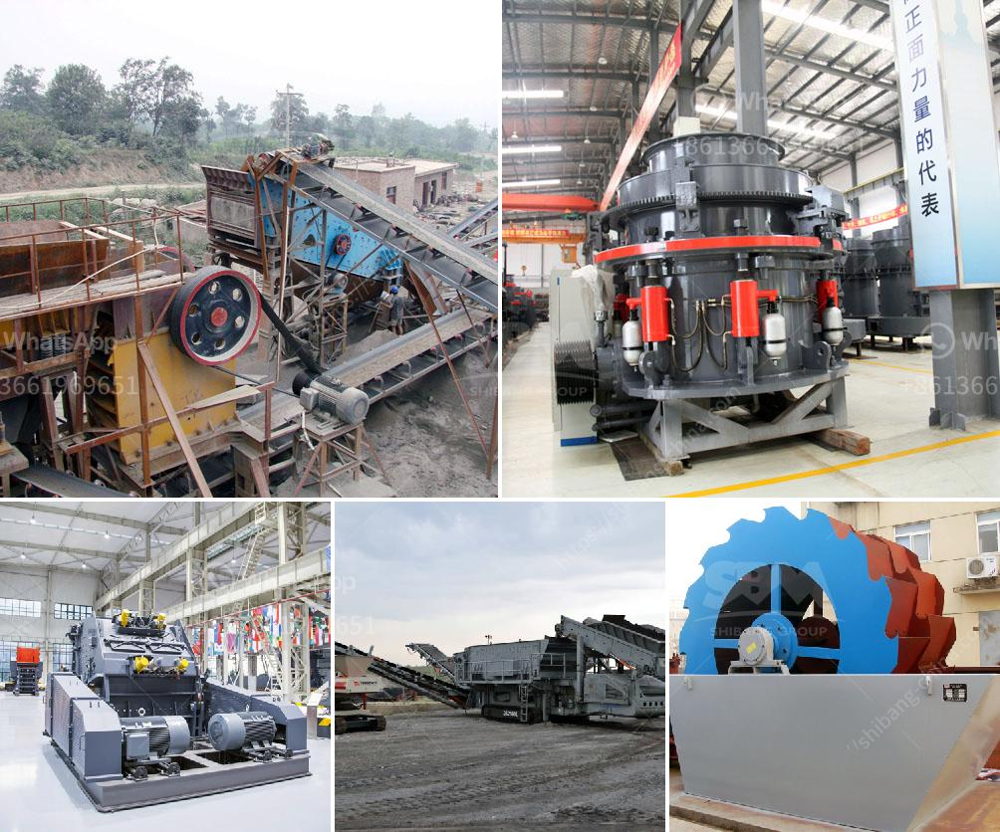

<h3>impact crusher for sale in bulawayo</h3>
An impact crusher is a very useful secondary crushing equipment which works by impacting the material fed into it, through the use of high-speed rotating hammers. It works on the principle of impact crushing, where the compression is done by the impact force generated by the hammers. These machines are commonly used in mining, construction, and recycling industries for crushing hard and abrasive materials.

If you are in Bulawayo and in need of an impact crusher, you are in luck! There are several options available for purchasing a quality impact crusher in the city. One of the best options is to check with local suppliers and manufacturers of mining equipment. They usually have a wide range of crushers for sale, including impact crushers.

When looking for an impact crusher for sale in Bulawayo, it is important to consider the size and capacity of the machine. The size of the crusher determines the maximum feed size you can have, and the capacity determines the amount of material the crusher can handle per hour. It is advisable to buy a crusher that can handle your specific needs to ensure optimal performance and productivity.

Another important factor to consider when purchasing an impact crusher is the quality and durability of the machine. It is always a good idea to buy from reputable manufacturers known for producing high-quality equipment. This will ensure that you get a reliable and long-lasting machine that will serve you well for years to come.

Additionally, it is worth considering the after-sales service and support offered by the supplier. A good supplier should offer technical support, spare parts availability, and maintenance services to ensure that your machine is always in good condition and running efficiently.

In conclusion, if you are looking for an impact crusher for sale in Bulawayo, there are several options available to you. Consider the size, capacity, quality, and after-sales support offered by the supplier when making your purchase decision. With the right impact crusher, you can efficiently crush hard and abrasive materials for your mining or construction needs.
<h3>Contact us</h3><ul><li><strong>Whatsapp:&nbsp;<a href="https://wa.me/8613661969651">+8613661969651</a></strong></li><li><a href="https://swt.shibang-china.com/?git&amp;zhl&amp;impact crusher for sale in bulawayo"><strong>Online Service(chat now)</strong></a></li></ul><h3>Related</h3><ul><li><a href='feldspar crusher supplier.md'>feldspar crusher supplier</a></li><li><a href='primary impact crusher disadvantages.md'>primary impact crusher disadvantages</a></li><li><a href='price of industrial crusher in nigeria.md'>price of industrial crusher in nigeria</a></li><li><a href='coal screening machine in india.md'>coal screening machine in india</a></li><li><a href='ultrafine mill grinder.md'>ultrafine mill grinder</a></li></ul>