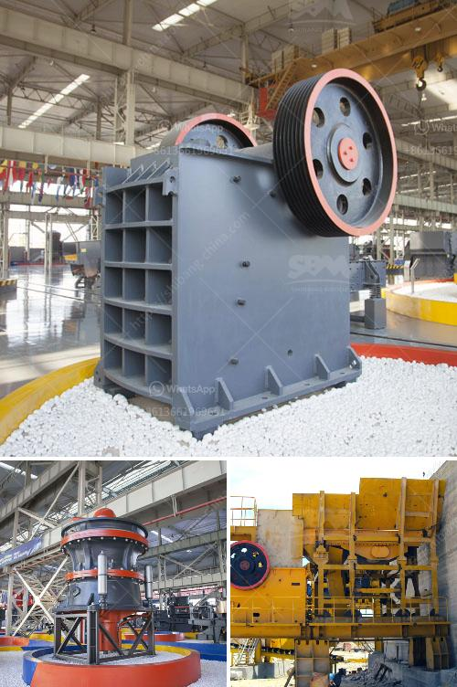

<h3>impact crusher ld pfw</h3>
The LD PFW impact crusher is a revolutionary machine that has been designed to meet the needs of customers in the mining, quarrying and recycling industries. It combines high reduction ratios with superior product shape and consistent gradation to eliminate the need for secondary crushing processes. With its advanced features and cutting-edge technology, the LD PFW impact crusher offers unparalleled performance and efficiency.

One of the key features of the LD PFW impact crusher is its hydraulic system. This system allows for easy adjustment of the crusher settings to achieve the desired product size and shape. The hydraulic system also ensures smooth and reliable operation, reducing downtime and increasing overall productivity. Additionally, the hydraulic system enables the crusher to automatically compensate for wear, ensuring consistent performance over time.

The LD PFW impact crusher is also equipped with a high-speed rotor that provides a strong impact force. The rotor has been specially designed for heavy-duty applications and is capable of crushing even the toughest materials. This high-speed rotor, combined with the advanced chamber design, ensures excellent reduction ratios and superior product shape. The LD PFW impact crusher is perfect for producing high-quality aggregates for use in road construction, concrete production, and other applications.

In terms of safety, the LD PFW impact crusher incorporates several features to protect operators and maintenance personnel. The crusher is equipped with a hydraulic opening device, which allows for easy and safe access to the crushing chamber. This feature significantly reduces the risk of accidents and ensures quick and efficient maintenance.

The LD PFW impact crusher is also designed with sustainability in mind. It features a low energy consumption design, reducing the impact on the environment. Furthermore, the crusher is equipped with a dust suppression system to minimize dust emissions, providing a healthier and safer working environment for operators.

Overall, the LD PFW impact crusher is a game-changer in the crushing industry. Its advanced features, such as the hydraulic system, high-speed rotor, and safety mechanisms, make it a versatile and efficient machine for various applications. Whether in mining, quarrying, or recycling, the LD PFW impact crusher delivers exceptional performance and ensures customer satisfaction. With its focus on productivity, safety, and sustainability, the LD PFW impact crusher sets a new benchmark for the industry and offers a reliable solution for all crushing needs.
<h3>Contact us</h3><ul><li><strong>Whatsapp:&nbsp;<a href="https://wa.me/8613661969651">+8613661969651</a></strong></li><li><a href="https://swt.shibang-china.com/?git&amp;zhl&amp;impact crusher ld pfw"><strong>Online Service(chat now)</strong></a></li></ul><h3>Related</h3><ul><li><a href='france used conveyor belts for sale.md'>france used conveyor belts for sale</a></li><li><a href='how to set up a crushing plant.md'>how to set up a crushing plant</a></li><li><a href='price list of grinding equipment for sale.md'>price list of grinding equipment for sale</a></li><li><a href='grinding mill machine roller mill size.md'>grinding mill machine roller mill size</a></li><li><a href='calcium carbonate manufacturing process.md'>calcium carbonate manufacturing process</a></li></ul>