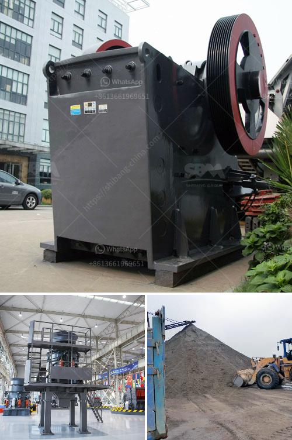

<h3>impact crusher machine for sale</h3>
In the era of rapid technological advancement, it can often be difficult to keep up with the latest innovations. As the demand for more efficient and reliable crushing equipment grows, the importance of finding the right equipment becomes paramount. This is where impact crusher machines come into play.

An impact crusher machine is a versatile and efficient machine that breaks down and crushes rocks into smaller pieces. This machine is vital in many industries, including mining, construction, and recycling. It allows for the crushing of rocks into various sizes and shapes, making them easier to transport and use in other applications.

One of the primary benefits of using an impact crusher machine is its ability to produce a consistent and uniform product. The machine's unique design ensures that every particle is subjected to the impact forces generated by the rotating hammers. This results in a higher quality product with less fines, making it ideal for use in concrete production, asphalt manufacturing, and even for creating base materials for road construction.

Another significant advantage of impact crusher machines is their versatility. These machines can be used to crush a wide variety of materials, including limestone, granite, concrete, and more. This makes them suitable for a wide range of applications, from mining operations to construction sites. Additionally, many impact crusher machines come with adjustable output settings, allowing operators to fine-tune the machine's performance to meet specific project requirements.

The availability of impact crusher machines for sale has made them more accessible to businesses of all sizes. Whether you're a small-scale contractor or a large mining company, there's an impact crusher machine out there that suits your needs. Buying a used impact crusher machine can also be a cost-effective solution for those looking to upgrade their equipment without breaking the bank.

In conclusion, impact crusher machines have revolutionized the crushing industry by providing efficient and reliable crushing solutions. Their ability to produce a consistent and uniform product, coupled with their versatility, makes them indispensable in various industries. So, if you're in the market for crushing equipment, consider investing in an impact crusher machine. It's a game-changer that will undoubtedly improve your productivity and bottom line.
<h3>Contact us</h3><ul><li><strong>Whatsapp:&nbsp;<a href="https://wa.me/8613661969651">+8613661969651</a></strong></li><li><a href="https://swt.shibang-china.com/?git&amp;zhl&amp;impact crusher machine for sale"><strong>Online Service(chat now)</strong></a></li></ul><h3>Related</h3><ul><li><a href='accessories for conveyor belts.md'>accessories for conveyor belts</a></li><li><a href='advantech grinding mill india.md'>advantech grinding mill india</a></li><li><a href='jaw crusher materials.md'>jaw crusher materials</a></li><li><a href='ball mill battery lead pdf.md'>ball mill battery lead pdf</a></li><li><a href='mini rock crusher.md'>mini rock crusher</a></li></ul>