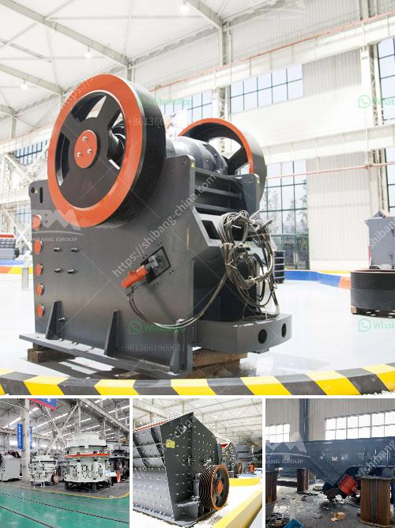

<h3>impact crusher manufacturers in saudi</h3>
Saudi Arabia is rich in oil reserves and many other minerals. The government of the country promotes domestic industrial development and mining projects, because it believes that it can bring significant economic benefits to the country. With the continuous growth of the construction industry, the demand for aggregate and sand is also increasing. This has led to the development of crushers that are capable of processing a variety of materials, including concrete, asphalt, and even natural stones. Among all these crushers, impact crushers are the most commonly used crushing machines.

An impact crusher is often used in the construction industry for producing crushed stones. It has the ability to break large pieces of stones with less energy consumption. This machinery is highly utilized in many applications due to its ability to crush materials at high speed and high efficiency. Additionally, it is capable of producing uniformly shaped stones that are suitable for construction purposes.

In Saudi Arabia, there are several well-known and experienced impact crusher manufacturers, such as Metso, Sandvik, and Hazemag. These manufacturers have different strengths and characteristics, allowing them to target different market segments. In this article, we will analyze the top three impact crusher manufacturers and their benefits.

Metso is a well-established global supplier of crushers and crushing equipment. It offers a complete range of products that are widely used in the mining and construction industries, such as jaw crushers, cone crushers, impact crushers, and more. They also develop custom-made crushers based on customer requirements.

Metso impact crushers are known for their high quality and long service life. These machines are suitable for a wide range of crushing applications, including primary, secondary, and tertiary crushing. With their advanced technology and innovative design, Metso impact crushers can exceed the expectations of customers.

Sandvik is a leading global manufacturer of equipment and tools for the mining and construction industries. It offers a wide range of crushers, including impact crushers, jaw crushers, cone crushers, and mobile crushers. These crushers are designed to process a variety of materials, including hard rocks, minerals, and construction waste.

Sandvik impact crushers are highly efficient machines that provide high performance and productivity. They are easy to operate and maintain, making them ideal for customers who value simplicity and reliability. With their sophisticated controls and automation, Sandvik impact crushers can improve the safety and efficiency of crushing operations.

Hazemag is a German-based manufacturer that specializes in impact crushers. Since its establishment in the 1940s, the company has successfully developed a range of impact crushers that are widely used in various industries, including mining, cement, and aggregates. Hazemag impact crushers are known for their robust construction and durability.

Hazemag impact crushers are capable of processing a variety of materials, including hard rocks and soft minerals. They are characterized by their high reduction ratios and high crushing efficiency. These machines are equipped with advanced features and technologies that ensure high productivity and low operating costs.

In conclusion, impact crushers are widely used in the construction industry in Saudi Arabia. With the growth of the construction industry, the demand for aggregate and sand is increasing, and impact crushers provide an efficient solution for crushing materials. Metso, Sandvik, and Hazemag are among the top impact crusher manufacturers in Saudi Arabia. These manufacturers focus on developing environmentally friendly, energy-efficient, and high-performance products that cater to the needs of customers. By choosing the right impact crusher manufacturer, customers can benefit from high-quality products that ensure long service life and high productivity.
<h3>Contact us</h3><ul><li><strong>Whatsapp:&nbsp;<a href="https://wa.me/8613661969651">+8613661969651</a></strong></li><li><a href="https://swt.shibang-china.com/?git&amp;zhl&amp;impact crusher manufacturers in saudi"><strong>Online Service(chat now)</strong></a></li></ul><h3>Related</h3><ul><li><a href='how to start quarry business.md'>how to start quarry business</a></li><li><a href='trommel small mobile wash plants for sale.md'>trommel small mobile wash plants for sale</a></li><li><a href='iron ore beneficiation process flow chart.md'>iron ore beneficiation process flow chart</a></li><li><a href='best jaw crusher for making stone.md'>best jaw crusher for making stone</a></li><li><a href='crushing and mining equipment companies in uae.md'>crushing and mining equipment companies in uae</a></li></ul>