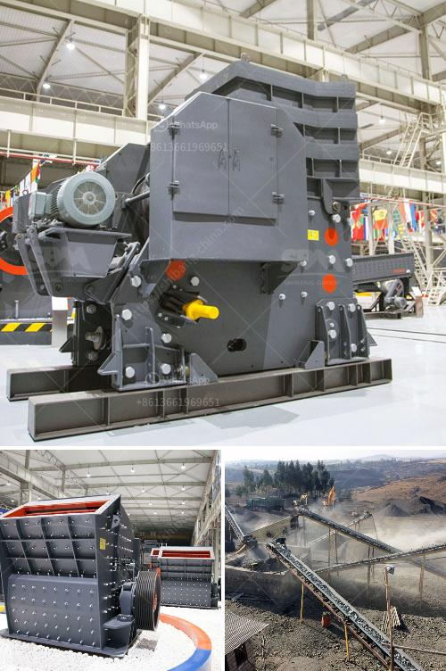

<h3>impact crusher vsi price alibaba</h3>
In today's construction and mining industry, efficiency and cost-effectiveness are crucial factors that determine the success of a project. As a result, the demand for high-quality machinery, such as impact crushers, has been steadily increasing. The rapid advancement in technology has led to the development of various types of crushers, including the VSI (Vertical Shaft Impact) crusher. When it comes to purchasing an impact crusher VSI, Alibaba is a prominent platform that offers competitive prices. Let's delve into the details and understand the benefits and considerations associated with the purchase.

First and foremost, one needs to comprehend the concept of an impact crusher VSI. Essentially, this particular crusher is designed to crush materials into smaller sizes by applying high-speed impact force. The VSI crusher consists of a rotor that rotates at high speed, throwing the stones against the anvils within the crushing chamber. Due to this unique crushing mechanism, VSI crushers are able to produce superior-shaped aggregates, making them highly sought after in the construction industry.

When considering the purchase of an impact crusher VSI, Alibaba offers a wide range of options at varying prices. This platform serves as a bridge between buyers and sellers, enabling customers to explore numerous products and make informed decisions. With a plethora of options available, buyers can compare prices, features, and customer reviews to ensure they find the best value for their investment.

The price of an impact crusher VSI on Alibaba can vary based on multiple factors. Firstly, the brand and reputation of the manufacturer play a significant role in determining the price. Established and renowned manufacturers tend to charge a premium for their products due to their quality and reliability. However, emerging manufacturers might offer lower prices as a strategy to gain market share and establish their brand. As a buyer, it is essential to consider the reputation of the manufacturer, as investing in a reliable product will be beneficial in the long run.

Another factor influencing the price of an impact crusher VSI is its specifications and features. Crushers with higher production capacities, advanced technology, and additional features like adjustable rotor speed and automated operation tend to have higher price tags. These features often enhance productivity and efficiency, thereby justifying the higher cost. Buyers must assess their specific requirements and budget to determine the most suitable product that meets their needs.

It is worth mentioning that while price is an important consideration, it should not be the sole determining factor. Other aspects such as customer service, warranty, and after-sales support are equally crucial. Purchasing from Alibaba provides customers with the advantage of accessing detailed product information, customer reviews, and seller ratings. This information helps buyers make an informed decision and ensures a seamless buying experience.

In conclusion, Alibaba offers a plethora of options for impact crusher VSI at varying prices, catering to the diverse needs of customers. While the price is an essential factor, buyers should also consider the reputation of the manufacturer, specifications, and additional features before making a purchase. By taking these factors into account, customers can find an impact crusher VSI that offers the best value for their investment. Remember, efficiency and cost-effectiveness are the keys to success in the construction and mining industry, and a reliable impact crusher VSI can significantly contribute to achieving these goals.
<h3>Contact us</h3><ul><li><strong>Whatsapp:&nbsp;<a href="https://wa.me/8613661969651">+8613661969651</a></strong></li><li><a href="https://swt.shibang-china.com/?git&amp;zhl&amp;impact crusher vsi price alibaba"><strong>Online Service(chat now)</strong></a></li></ul><h3>Related</h3><ul><li><a href='iron ore process crushing.md'>iron ore process crushing</a></li><li><a href='copper crusher manufacturer.md'>copper crusher manufacturer</a></li><li><a href='brand new stone crusher for sale in the philippines.md'>brand new stone crusher for sale in the philippines</a></li><li><a href='hydraulic impact crusher.md'>hydraulic impact crusher</a></li><li><a href='small crusher project.md'>small crusher project</a></li></ul>