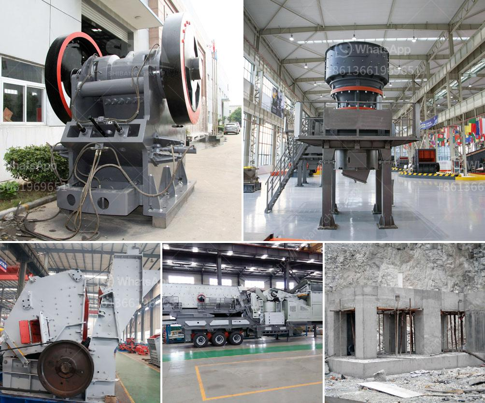

<h3>impact crushers for rent</h3>
Crushing is an essential process in a wide range of industries, from mining and construction to recycling and demolition. However, achieving the desired final product size and shape can be challenging with traditional crushing equipment. This is where impact crushers come into play. Designed to break down materials through high-velocity impact forces, these machines offer efficient and affordable solutions for your crushing needs. And the best part is that you can now find impact crushers for rent, allowing you to access these powerful machines without breaking the bank.

Impact crushers, also known as impactors or horizontal shaft impactors (HSIs), consist of a rotor, a large feed opening, and hydraulic curtains or aprons that ensure a consistent and unrestricted flow of material. When the rotor spins at high speed, the incoming feed material is struck by the blow bars, generating tremendous impact forces that shatter the material into smaller pieces. This process is often referred to as "rock on rock" crushing.

One of the key advantages of impact crushers is their versatility. They can handle a wide range of materials, from soft to medium-hard rocks and even abrasive materials like granite or basalt. As a result, they find applications in various industries, including mining, construction, and recycling. Impact crushers are commonly used to crush concrete, asphalt, limestone, or even demolition debris.

Renting impact crushers offers several benefits for businesses looking to enhance their crushing capabilities. Firstly, it allows companies to access advanced crushing technology without significant upfront costs. Purchasing a new impact crusher could require a substantial investment, especially for small or medium-sized businesses. On the other hand, renting gives you the opportunity to try different models and see which one suits your specific needs before committing to a long-term investment.

Moreover, renting impact crushers can help prevent downtime during equipment maintenance or repairs. When you own a crusher, any breakdown or malfunction can bring your operations to a halt until the issue is fixed. However, by renting, you can always have a backup crusher readily available to continue production and meet your deadlines.

Another advantage of renting impact crushers is the flexibility it offers in terms of capacity and size. Depending on your project requirements, you can choose a machine with the right output capacity, from small units ideal for urban environments to larger models suitable for high-volume crushing operations. This flexibility allows you to optimize your productivity while reducing costs.

In conclusion, impact crushers for rent provide an affordable solution for various industries that require efficient and versatile crushing equipment. These machines offer numerous advantages, such as cost savings, enhanced productivity, and reduced downtime. Whether you're in mining, construction, or recycling, renting an impact crusher allows you to access the latest technology and meet your crushing needs with ease. So, consider renting an impact crusher and take your crushing operations to the next level.
<h3>Contact us</h3><ul><li><strong>Whatsapp:&nbsp;<a href="https://wa.me/8613661969651">+8613661969651</a></strong></li><li><a href="https://swt.shibang-china.com/?git&amp;zhl&amp;impact crushers for rent"><strong>Online Service(chat now)</strong></a></li></ul><h3>Related</h3><ul><li><a href='sayaji jaw crusher vadodara.md'>sayaji jaw crusher vadodara</a></li><li><a href='cost of feldspar crushing machine pakistan.md'>cost of feldspar crushing machine pakistan</a></li><li><a href='rock belt conveyor spec.md'>rock belt conveyor spec</a></li><li><a href='quotation for crushing and screening.md'>quotation for crushing and screening</a></li><li><a href='tph stationery stone crushing plant.md'>tph stationery stone crushing plant</a></li></ul>