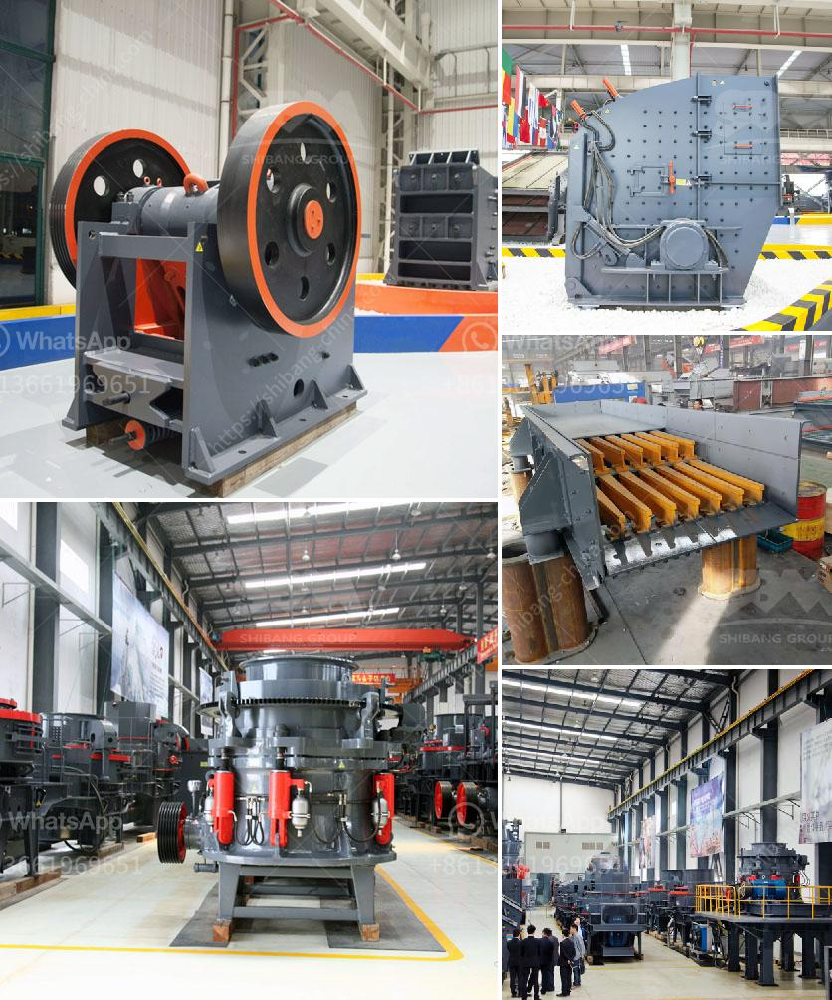

<h3>india second hand ball mill for sale</h3>
India is a land of diverse cultures and traditions. Known for its rich history and heritage, this country never fails to amaze its visitors. Aside from its cultural abundance, India is also known for its thriving economy. With a rapidly expanding industrial sector, there is a constant demand for machinery and equipment. One such equipment that is widely used in industries across India is the ball mill.

A ball mill is a cylindrical machine used for grinding materials into fine powders. It consists of a horizontal rotating shell filled with steel balls. The material to be grinded is fed into the shell, and as the mill rotates, the balls impact and grind the material, reducing it to the desired fineness. Ball mills are commonly used in cement, silicate products, new building materials, refractory materials, fertilizers, ferrous and non-ferrous metal beneficiation, and glass ceramics industries.

Buying a brand-new ball mill can be a substantial investment, especially for small and medium-sized enterprises. However, thanks to the availability of second-hand ball mills in India, many businesses can afford to expand their operations without putting a strain on their finances. Second-hand ball mills are a cost-effective alternative to buying a new mill. They are usually sold at a fraction of the original price, making them an attractive option for businesses on a budget.

There are various sources in India where one can find second-hand ball mills for sale. Online portals, auction websites, and local classifieds are some of the popular platforms that offer used ball mills. These platforms connect sellers and buyers from all over the country, making it easier to find the right equipment.

To ensure a successful purchase of a second-hand ball mill, buyers should consider certain key factors. First and foremost, it is important to inspect the mill thoroughly before making any commitments. This includes evaluating the machine's overall condition, checking for any signs of wear and tear, and testing its functionality. Additionally, buyers should inquire about the mill's maintenance history and any repairs that have been carried out. It is advisable to consult with a qualified technician or engineer to assess the suitability of the used mill for one's specific needs.

Another crucial aspect to consider is the reputation and credibility of the seller. It is essential to transact with reliable and trustworthy sellers to avoid any potential scams or substandard equipment. Reading reviews and testimonials from previous buyers can provide valuable insights into the seller's reputation.

Purchasing a second-hand ball mill can be a lucrative investment for businesses in India. It allows them to acquire high-quality machinery at a fraction of the original cost, thus improving their production capabilities and overall profitability. However, buyers must exercise caution and due diligence when searching for and evaluating used ball mills. By considering the factors mentioned above, businesses can confidently make informed decisions and reap the benefits of cost-effective equipment.
<h3>Contact us</h3><ul><li><strong>Whatsapp:&nbsp;<a href="https://wa.me/8613661969651">+8613661969651</a></strong></li><li><a href="https://swt.shibang-china.com/?git&amp;zhl&amp;india second hand ball mill for sale"><strong>Online Service(chat now)</strong></a></li></ul><h3>Related</h3><ul><li><a href='belt conveyor europe.md'>belt conveyor europe</a></li><li><a href='ball mill small for sale.md'>ball mill small for sale</a></li><li><a href='jual grinding roll mill.md'>jual grinding roll mill</a></li><li><a href='big stone crusher prices in south africa.md'>big stone crusher prices in south africa</a></li><li><a href='iron ore beneficiation process flow chart.md'>iron ore beneficiation process flow chart</a></li></ul>