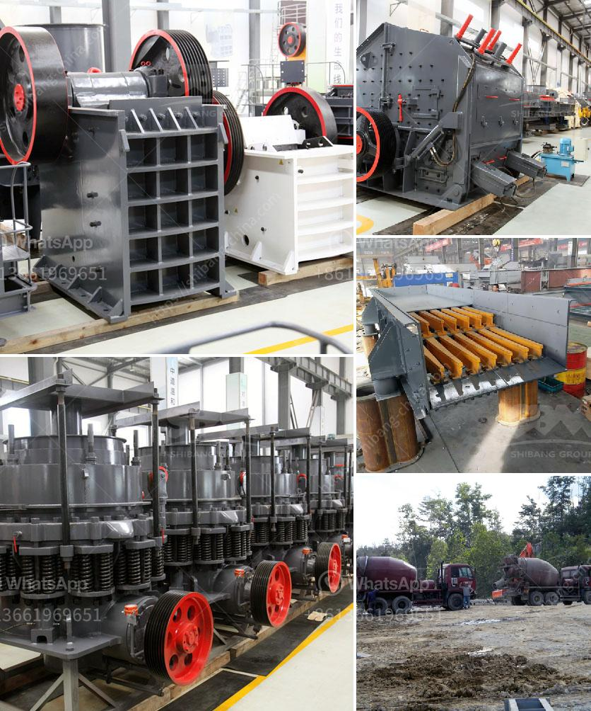

<h3>india vertical grinding machines</h3>
India, known as the land of spices, rich culture, and diverse traditions, has also emerged as a powerhouse in the manufacturing sector. The country has witnessed significant growth in various industries, including machine tools. Among them, vertical grinding machines have gained immense popularity, thanks to their precision, efficiency, and versatility.

Vertical grinding machines are a type of precision machine tool used for grinding and shaping surfaces. These machines have a vertical spindle that carries a grinding wheel, which rotates at a high speed, providing accurate and consistent results. They are particularly suitable for large workpieces or parts with complex shapes that require intricate grinding.

India has solidified its position as a major player in the global machine tools market, offering a wide range of vertical grinding machines. The manufacturers in India have invested in research and development and state-of-the-art technology to produce high-quality machines that cater to the diverse needs of various industries.

One of the key advantages of India vertical grinding machines is their high level of precision. These machines employ advanced control systems and innovative design features that ensure the grinding process is carried out with utmost accuracy. The ability to achieve fine finishes and tight tolerances makes them ideal for applications where precision is paramount, such as aerospace, automotive, and medical industries.

Another notable feature of India vertical grinding machines is their efficiency. These machines are designed to maximize productivity and reduce downtime. They incorporate automatic tool changers, which allow for quick and seamless switching between different grinding wheels or tools. This feature, coupled with high-speed spindles, significantly improves cycle times, making these machines highly productive and cost-effective.

Versatility is yet another strength of India vertical grinding machines. They can handle a wide range of materials, from soft to hard, and from ferrous to non-ferrous. This versatility allows manufacturers to use a single machine for multiple applications, eliminating the need for additional equipment and reducing overall investment.

Furthermore, India vertical grinding machines are known for their robust construction and durability. The manufacturers in India ensure that their machines are built to withstand heavy workloads and demanding operating conditions. This not only enhances their longevity but also minimizes maintenance requirements, resulting in increased uptime and reduced operational costs.

As India continues to make strides in the global manufacturing landscape, the demand for vertical grinding machines is expected to rise further. Manufacturers in India are continuously refining their offerings to meet the evolving needs of the industry. They are focusing on technological advancements, such as incorporating artificial intelligence and automation, to further enhance the capabilities of these machines.

In conclusion, India vertical grinding machines have established themselves as a reliable and efficient tool for precision grinding applications. With their high level of precision, efficiency, versatility, and durability, these machines have become indispensable in various industries. As India continues its journey towards manufacturing excellence, vertical grinding machines from the country are set to shape the future of the global machine tools industry.
<h3>Contact us</h3><ul><li><strong>Whatsapp:&nbsp;<a href="https://wa.me/8613661969651">+8613661969651</a></strong></li><li><a href="https://swt.shibang-china.com/?git&amp;zhl&amp;india vertical grinding machines"><strong>Online Service(chat now)</strong></a></li></ul><h3>Related</h3><ul><li><a href='ore crushers benoni.md'>ore crushers benoni</a></li><li><a href='used chrome ore mining crushing equipment crusher.md'>used chrome ore mining crushing equipment crusher</a></li><li><a href='limestone mining crusher industry in nepal.md'>limestone mining crusher industry in nepal</a></li><li><a href='lime stone processing machine.md'>lime stone processing machine</a></li><li><a href='mini cement plant for sale in india.md'>mini cement plant for sale in india</a></li></ul>