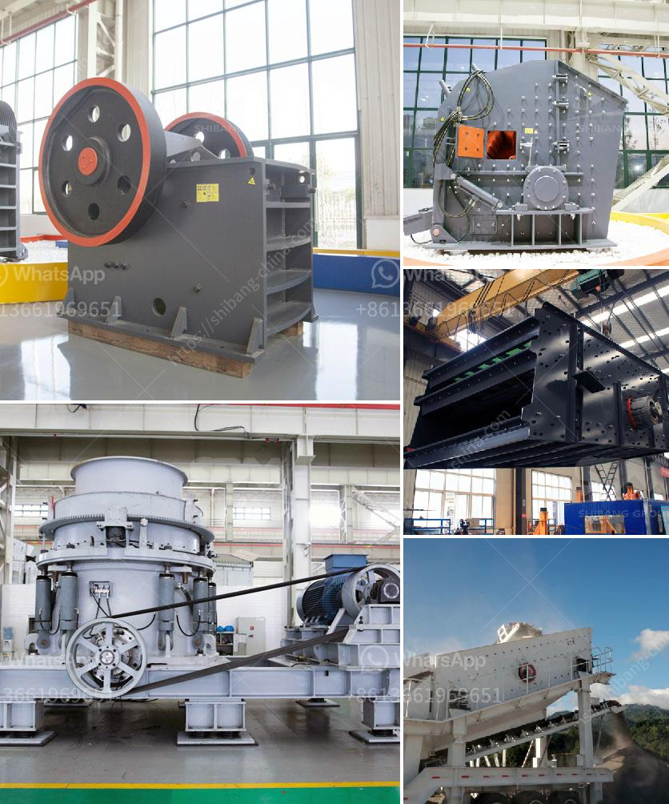

<h3>indonesia crushers of how much price</h3>
Indonesia, with its abundant natural resources, is a country that heavily relies on the mining industry. Crushers play a crucial role in breaking down rocks, minerals, and ores into smaller pieces for further processing. In recent years, the demand for high-quality crushers has been on the rise, prompting manufacturers to offer a wide range of options to cater to different needs. But how much do these crushers cost in Indonesia?

The price of crushers in Indonesia can vary significantly depending on various factors such as the type of crusher, capacity, brand, and additional features. Basic crushers designed for small-scale operations or simple quarrying tasks can start from as low as IDR 15 million (approximately $1000). These crushers often have lower capacity and may be manual or semi-automatic.

On the other hand, more advanced crushers with higher capacity, automation, and sophisticated features can have a price range of IDR 50-100 million (approximately $3500-$7000). These crushers are typically used in larger mining operations or for processing harder materials where efficiency and reliability are crucial.

For large-scale mining companies or contractors, high-capacity crushers with advanced automation and cutting-edge technology can be priced at IDR 150-300 million (approximately $10,000-$20,000) or even higher. These premium crushers are capable of handling large volumes of materials and offer enhanced efficiency, productivity, and safety.

It is important to note that the prices mentioned above are approximate and may vary depending on market conditions, geographical location, and other factors. Additionally, there may be additional costs such as transportation, installation, and maintenance that need to be considered when purchasing a crusher.

When deciding on a crusher, it is essential to assess your specific requirements, the type of material being processed, and the expected output. Consulting with experts or conducting thorough research can help ensure the right crusher is selected at an optimal price point.

In conclusion, the price of crushers in Indonesia can range from IDR 15 million to several hundred million rupiahs depending on the type, capacity, and additional features. Investing in the right crusher is crucial for efficient mining operations, and considering the long-term benefits, the cost is justified.
<h3>Contact us</h3><ul><li><strong>Whatsapp:&nbsp;<a href="https://wa.me/8613661969651">+8613661969651</a></strong></li><li><a href="https://swt.shibang-china.com/?git&amp;zhl&amp;indonesia crushers of how much price"><strong>Online Service(chat now)</strong></a></li></ul><h3>Related</h3><ul><li><a href='crush calcite equipment.md'>crush calcite equipment</a></li><li><a href='manufacturing process of plaster of paris china.md'>manufacturing process of plaster of paris china</a></li><li><a href='how much is a crusher mincer in malaysia.md'>how much is a crusher mincer in malaysia</a></li><li><a href='coltan milling equipment in south africa.md'>coltan milling equipment in south africa</a></li><li><a href='types of aggregate crushers pdf.md'>types of aggregate crushers pdf</a></li></ul>