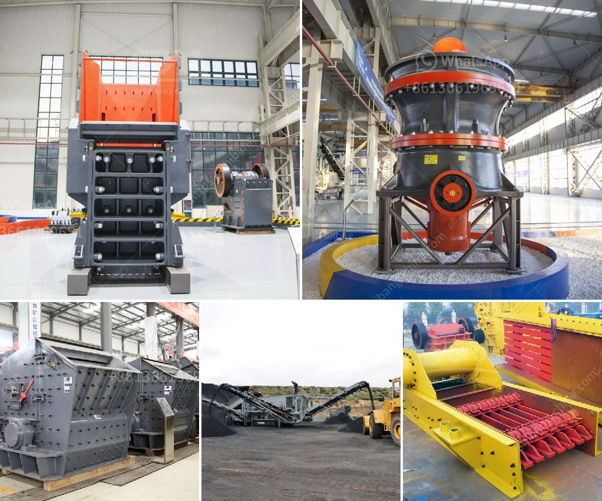

<h3>industrial gold mining equipment suppliers</h3>
Industrial gold mining equipment suppliers play a vital role in the mining industry. These companies provide the necessary equipment and machinery required for efficient and effective gold mining operations. Gold is one of the most valuable minerals globally, and its extraction requires specialized equipment to ensure maximum productivity and profitability.

These suppliers offer a wide range of equipment, including excavators, bulldozers, loaders, crushers, conveyors, and drills. Each piece of equipment is designed to perform specific tasks within the mining process, such as ore extraction, material handling, crushing and grinding, and waste management. The suppliers understand the unique needs of gold mining operations and provide equipment that is both durable and efficient.

One of the leading industrial gold mining equipment suppliers is Caterpillar. Caterpillar offers a full range of mining equipment, from small-scale to large-scale operations. Their equipment is designed to withstand the harsh conditions of the mining industry and ensure maximum productivity. For example, their hydraulic excavators are equipped with advanced technologies that provide high digging and lifting power, allowing for faster and more efficient ore extraction.

Another reputable supplier is Komatsu. Komatsu provides a comprehensive range of mining equipment, including bulldozers, loaders, and crushers. Their equipment is known for its reliability and durability, ensuring that mining operations run smoothly without any major breakdowns. Komatsu's bulldozers are particularly popular in gold mining operations because of their ability to push large quantities of earth and handle rough terrains.

In addition to Caterpillar and Komatsu, there are many other industrial gold mining equipment suppliers that cater to the specific needs of gold mining companies. These suppliers include Sandvik, Liebherr, and Hitachi, among others. Each of these companies offers a range of equipment designed to meet the demands of different mining operations.

When selecting a supplier, gold mining companies consider factors such as the reputation and track record of the supplier, the quality and durability of their equipment, after-sales service, and pricing. It is crucial for companies to choose reliable suppliers that can provide the necessary equipment on-time and offer ongoing support and maintenance services. Furthermore, suppliers that can provide customized solutions tailored to the specific needs of a mining operation are often preferred.

In conclusion, industrial gold mining equipment suppliers play a crucial role in the success of gold mining operations. They provide the necessary equipment and machinery required to extract and process gold efficiently and effectively. Caterpillar, Komatsu, and other leading suppliers offer a comprehensive range of equipment designed to meet the unique needs of gold mining operations. When selecting a supplier, companies consider factors such as reputation, quality of equipment, after-sales service, and customization options. With the right equipment from reliable suppliers, gold mining companies can maximize productivity, profitability, and sustainability.
<h3>Contact us</h3><ul><li><strong>Whatsapp:&nbsp;<a href="https://wa.me/8613661969651">+8613661969651</a></strong></li><li><a href="https://swt.shibang-china.com/?git&amp;zhl&amp;industrial gold mining equipment suppliers"><strong>Online Service(chat now)</strong></a></li></ul><h3>Related</h3><ul><li><a href='crushing plant price.md'>crushing plant price</a></li><li><a href='quarry and stone crushing executive business plan.md'>quarry and stone crushing executive business plan</a></li><li><a href='barite powder processing plant process.md'>barite powder processing plant process</a></li><li><a href='copper ore separation machine.md'>copper ore separation machine</a></li><li><a href='jaw crusher in kenya.md'>jaw crusher in kenya</a></li></ul>