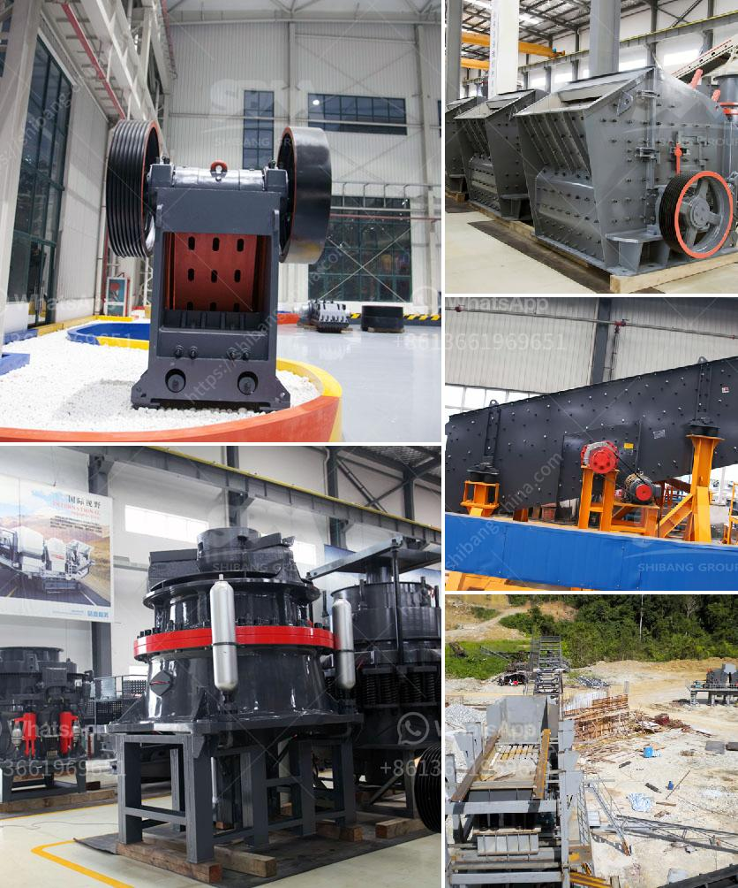

<h3>industrial grinder machine south africa</h3>
The industrial grinder machine South Africa is an essential piece of equipment in numerous industries that require grinding and polishing surfaces. This machine provides fast and efficient grinding on a large scale. It consists of a wide variety of tools and accessories, including abrasive discs, grinding wheels, and polishing pads.

One of the benefits of using an industrial grinder machine is its ability to handle heavy-duty tasks. It can grind and polish large metal surfaces, such as stainless steel or aluminum, to a high level of precision. In addition, it can remove excess material from the surface, creating a clean and smooth finish. This is especially useful in industries that require products with precise dimensions and a flawless appearance.

Another advantage of the industrial grinder machine South Africa is its versatility. It can be used for various applications, such as grinding, polishing, and even cutting. Different attachments and discs can be added to the machine to suit different tasks. For example, a diamond disc can be used for cutting hard materials like concrete or stone, while a wire brush attachment is ideal for removing rust or paint from metal surfaces.

The industrial grinder machine South Africa has numerous applications across different industries. In the automotive industry, it is commonly used for polishing car body panels, removing scratches or imperfections, and restoring the vehicle's appearance. In manufacturing plants, this machine is essential for grinding and polishing parts before assembly, ensuring they fit together seamlessly. In the construction industry, it is used for cutting and grinding concrete and other construction materials.

Not only is the industrial grinder machine South Africa powerful and versatile, but it also offers enhanced safety features. Many machines come with ergonomic designs that prioritize the operator's safety and comfort. Some models include features like automatic shut-off systems and guards to prevent accidents or injuries. This ensures that the machine can be operated safely, even in high-risk environments.

When purchasing an industrial grinder machine, it is important to consider factors such as power, speed, durability, and ease of use. Different models offer different features and capabilities, so it is essential to choose one that meets the specific requirements of the industry. Additionally, regular maintenance and proper usage are crucial for extending the machine's lifespan and ensuring optimal performance.

In conclusion, the industrial grinder machine South Africa is a valuable asset in various industries. Its powerful grinding and polishing capabilities make it an essential tool for achieving precise, smooth, and flawless surfaces. Its versatility and safety features further enhance its value, making it an indispensable piece of equipment. When selecting a machine, it is vital to choose one that meets the specific needs of the industry and invest in regular maintenance to prolong its lifespan.
<h3>Contact us</h3><ul><li><strong>Whatsapp:&nbsp;<a href="https://wa.me/8613661969651">+8613661969651</a></strong></li><li><a href="https://swt.shibang-china.com/?git&amp;zhl&amp;industrial grinder machine south africa"><strong>Online Service(chat now)</strong></a></li></ul><h3>Related</h3><ul><li><a href='sand washer turkey.md'>sand washer turkey</a></li><li><a href='marble processing machine.md'>marble processing machine</a></li><li><a href='mini rock crusher.md'>mini rock crusher</a></li><li><a href='rock crushers for sale ghana.md'>rock crushers for sale ghana</a></li><li><a href='cocoa processing plant in nigeria.md'>cocoa processing plant in nigeria</a></li></ul>