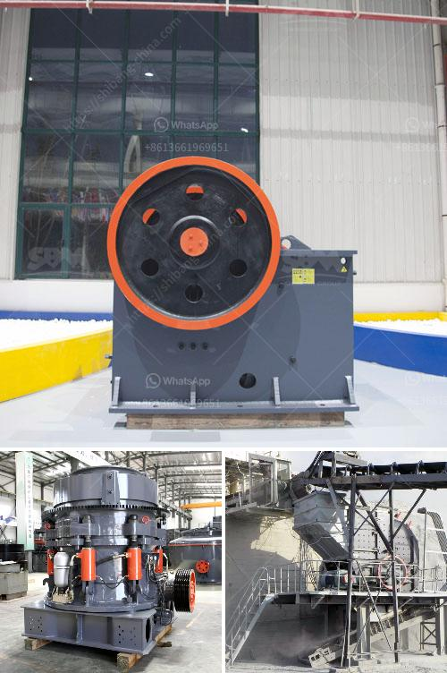

<h3>industrial hammer mill cost</h3>
The industrial hammer mill is a versatile machine used for grinding and crushing materials into smaller pieces. This power-driven machine consumes less energy, making it suitable for both small-scale and large-scale mill operators. However, before purchasing an industrial hammer mill, one must consider the cost implications. In this article, we will explore the factors that contribute to the cost of an industrial hammer mill.

Firstly, the size and capacity of the machine play a crucial role in determining its cost. A larger-sized hammer mill with higher processing capacity will typically cost more than a smaller one. For instance, a hammer mill with a capacity of 2 tons per hour will be more expensive than that with a capacity of 1 ton per hour. Therefore, it is essential to determine the required capacity according to the anticipated workload to avoid overspending.

Secondly, the level of sophistication and technology used in the hammer mill affects its cost. Modern hammer mills come with advanced features such as automated controls, digital displays, and remote monitoring capabilities. These features significantly improve efficiency but also raise the cost. Understanding the specific needs of your operation will help you determine the level of sophistication required in your chosen industrial hammer mill.

Additionally, the material used in manufacturing the hammer mill contributes to its cost. Some hammer mills are made of ordinary steel, while others are made of more durable and corrosion-resistant materials such as stainless steel. The choice of material depends on the nature of the materials being processed and the desired lifespan of the machine. Stainless steel hammer mills, although costlier, are preferred in industries where corrosion might be a concern.

Moreover, the cost of an industrial hammer mill can also depend on the brand and reputation of the manufacturer. Established brands with a long history of producing reliable and durable machines often command a higher price. However, they come with the assurance of quality and performance. On the other hand, lesser-known brands might offer lower prices but may lack the same level of reliability and after-sales support.

In addition to the initial cost, it is crucial to consider the long-term maintenance and operational costs associated with an industrial hammer mill. These machines require routine maintenance, including replacing worn-out parts such as screens and hammers. It is advisable to select a hammer mill that uses widely available and reasonably priced spare parts to ensure cost-effective maintenance.

Furthermore, energy consumption is a significant factor to consider in terms of ongoing operational costs. Energy-efficient hammer mills might have a higher initial cost, but they can result in substantial savings over time. Energy consumption can account for a significant portion of the operational expenses, particularly in large-scale operations. Therefore, selecting a hammer mill with low energy consumption can help optimize running costs.

In conclusion, the cost of an industrial hammer mill depends on various factors such as size, capacity, sophistication level, materials used, brand reputation, and ongoing maintenance and operational expenses. While it may be tempting to choose the cheapest option, it is crucial to consider the long-term impact and the specific requirements of your operation. By carefully evaluating these factors, you can ensure the right balance between cost and performance when purchasing an industrial hammer mill.
<h3>Contact us</h3><ul><li><strong>Whatsapp:&nbsp;<a href="https://wa.me/8613661969651">+8613661969651</a></strong></li><li><a href="https://swt.shibang-china.com/?git&amp;zhl&amp;industrial hammer mill cost"><strong>Online Service(chat now)</strong></a></li></ul><h3>Related</h3><ul><li><a href='ball mill particle size in micrometets.md'>ball mill particle size in micrometets</a></li><li><a href='stone crusher price in pakistan.md'>stone crusher price in pakistan</a></li><li><a href='second hand mobile crusher plant in india.md'>second hand mobile crusher plant in india</a></li><li><a href='size reduction equipment ball mill in details.md'>size reduction equipment ball mill in details</a></li><li><a href='concrete crusher for sale.md'>concrete crusher for sale</a></li></ul>