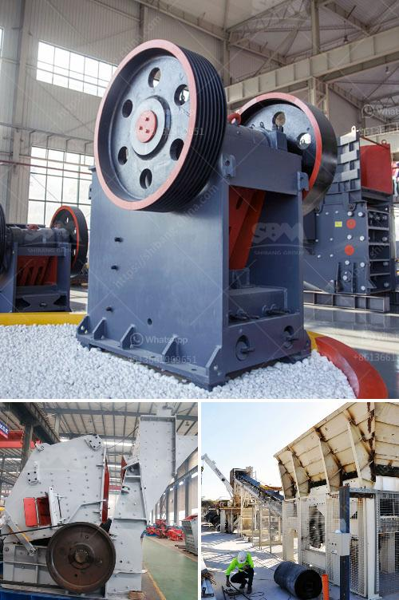

<h3>industrial hammer mill malaysia</h3>
The industrial hammer mill is a versatile machine used for grinding and milling solid materials into smaller particles. With powerful hammer blades and high-speed rotation, these mills are capable of reducing various types of waste materials, such as lumber, wooden pallets, construction debris, agricultural waste, and more, into uniform particle sizes. In Malaysia, the industrial hammer mill is widely used in various industries, including food processing, pharmaceuticals, chemical processing, and more.

One of the key advantages of the industrial hammer mill is its high processing capacity. With its robust construction and heavy-duty design, this mill can effectively process large volumes of materials quickly and efficiently. It is an ideal solution for operations that require continuous milling processes. Additionally, the mill's interchangeable screens allow for customization in particle size, enabling industries to achieve the desired end product.

Another major benefit of the industrial hammer mill is its versatility. It can handle a wide range of materials, including grains, spices, herbs, and even fibrous materials. This makes it ideal for various applications, such as grinding grains for animal feed, pulverizing spices for food processing, and breaking down fibrous materials for chemical processing. Its versatility allows industries to save time and resources by using a single machine for multiple purposes.

In Malaysia, the industrial hammer mill has become a popular choice for businesses looking to improve their productivity and reduce waste. Many industries, such as agriculture, sawmills, and wood processing, require the shredding of large volumes of waste materials. The industrial hammer mill provides a cost-effective and efficient solution for grinding and processing these waste materials into valuable products, such as animal feed and biomass pellets.

In conclusion, the industrial hammer mill is a reliable and versatile milling solution for various industries in Malaysia. Its high processing capacity, interchangeable screens, and ability to handle a wide range of materials make it an ideal choice for businesses looking to improve productivity and reduce waste. Whether in the food, chemical, or pharmaceutical industry, the industrial hammer mill offers a cost-effective and efficient solution for grinding and milling solid materials into smaller particles.
<h3>Contact us</h3><ul><li><strong>Whatsapp:&nbsp;<a href="https://wa.me/8613661969651">+8613661969651</a></strong></li><li><a href="https://swt.shibang-china.com/?git&amp;zhl&amp;industrial hammer mill malaysia"><strong>Online Service(chat now)</strong></a></li></ul><h3>Related</h3><ul><li><a href='cost of stone crusher production line in china.md'>cost of stone crusher production line in china</a></li><li><a href='coal processing plants for sale.md'>coal processing plants for sale</a></li><li><a href='tonne mobile crusher for sale philippines.md'>tonne mobile crusher for sale philippines</a></li><li><a href='crusher 50 ton per hour price.md'>crusher 50 ton per hour price</a></li><li><a href='conveyor belt capacity ton per hours.md'>conveyor belt capacity ton per hours</a></li></ul>