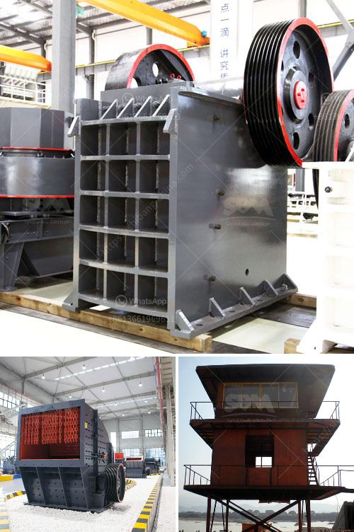

<h3>industrial mill crusher price</h3>
Industrial mill crushers are machines that are designed to reduce the size of material and grind it into a finer consistency. These machines are widely used in various industries, including mining, construction, pharmaceuticals, and more. When purchasing an industrial mill crusher, one of the most important factors to consider is the price.

The price of an industrial mill crusher can vary depending on several factors. Firstly, the type of crusher and its specifications play a significant role in determining the price. There are various types of crushers available in the market, such as jaw crushers, cone crushers, impact crushers, and hammer crushers. Each type has its own unique features and advantages, which can impact the price.

Another factor that affects the price is the capacity or throughput of the crusher. The capacity determines how much material can be processed per hour, and crushers with a higher capacity generally have a higher price. Additionally, the size and dimensions of the crusher also play a role in price determination. Larger crushers typically have a higher price compared to smaller ones.

The quality and durability of the crusher are also key factors in determining the price. Industrial mill crushers are subject to heavy-duty use and must be able to handle tough materials. Therefore, it is essential to choose a crusher that is made from high-quality materials, such as hardened steel, and is built to withstand the demands of industrial applications. Crushers with better build quality and durability tend to have a higher price.

The brand and reputation of the manufacturer can also impact the price. Well-established and reputable manufacturers often charge higher prices compared to lesser-known brands. This is because established brands are generally associated with better quality and reliability. However, it is important to note that higher price does not always guarantee higher quality, and it is advisable to research and read reviews before making a purchase.

Apart from the initial purchase price, it is essential to consider the long-term costs associated with the crusher. This includes maintenance and operating costs. Some crushers may require frequent maintenance and component replacements, which can add to the overall cost. Additionally, the energy consumption of the crusher can impact the operating costs. It is advisable to choose a crusher that is energy-efficient to minimize long-term costs.

In conclusion, the price of an industrial mill crusher can vary depending on factors such as the type, capacity, size, quality, brand, and long-term costs. It is important to consider these factors and evaluate the specific requirements of your industry before making a purchase. Remember to research and compare different options to ensure that you get the best value for your money.
<h3>Contact us</h3><ul><li><strong>Whatsapp:&nbsp;<a href="https://wa.me/8613661969651">+8613661969651</a></strong></li><li><a href="https://swt.shibang-china.com/?git&amp;zhl&amp;industrial mill crusher price"><strong>Online Service(chat now)</strong></a></li></ul><h3>Related</h3><ul><li><a href='coal crushing plant price.md'>coal crushing plant price</a></li><li><a href='china stone grinding mill.md'>china stone grinding mill</a></li><li><a href='mining rock quarry crusher for sale.md'>mining rock quarry crusher for sale</a></li><li><a href='price list of stone crusher in india.md'>price list of stone crusher in india</a></li><li><a href='limestone process plant.md'>limestone process plant</a></li></ul>