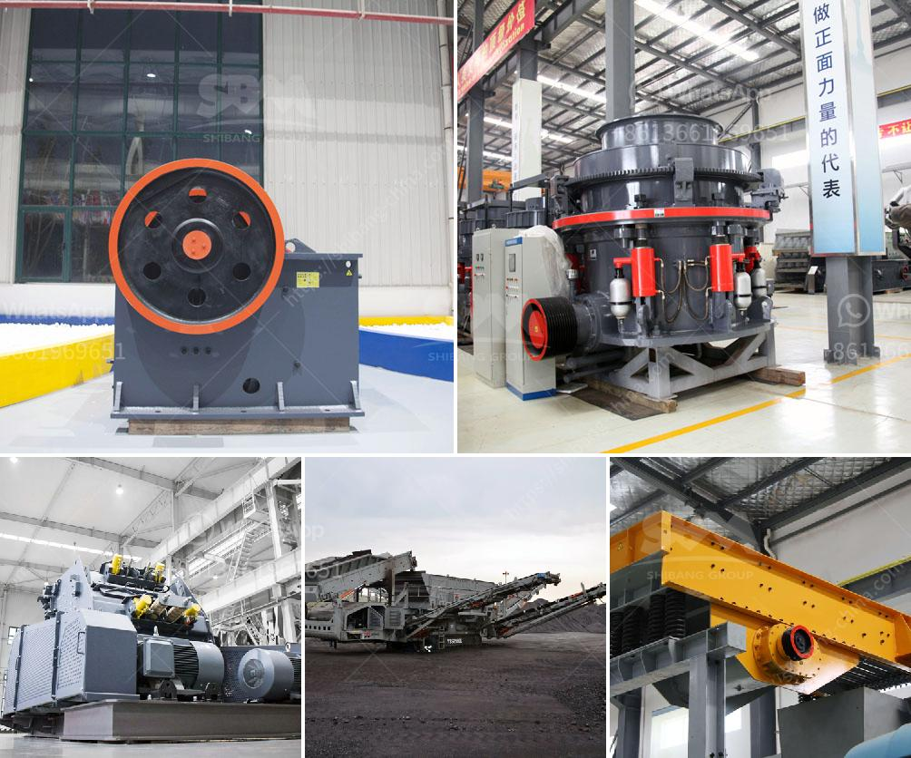

<h3>industrial mill price industrial mill</h3>
The industrial sector plays a vital role in accelerating economic growth and development across the globe. This sector encompasses a wide range of activities, from manufacturing to mining, where various machinery and equipment are required to facilitate efficient operations. Among these crucial machines, the industrial mill stands out as a key player.

An industrial mill, also known as a milling machine, is a device that grinds solid materials into smaller particles. Its main function is to reduce the size of raw materials, such as minerals, ores, ceramics, and chemicals, to be further processed or used in various industrial applications. These mills come in different sizes, types, and configurations, catering to the diverse needs of different industries.

The price of an industrial mill depends on several factors, including its size, capacity, features, and brand reputation. Typically, larger and more advanced mills tend to have a higher price tag. The price range for industrial mills can vary significantly, starting from a few thousand dollars and going up to hundreds of thousands of dollars, depending on the specifications.

One market segment for industrial mills is the mining industry. Mining operations involve the extraction of valuable resources from the earth, such as coal, gold, copper, and diamonds. To obtain these minerals, large quantities of ores need to be processed and ground into finer particles. Industrial mills are indispensable in this process, enabling mining companies to extract and refine minerals efficiently.

In the manufacturing industry, industrial mills play a crucial role in transforming raw materials into useful products. Whether it is food processing, pharmaceutical production, or building materials manufacturing, mills are essential for size reduction, blending, and homogenization of various substances. The efficiency and reliability of these mills directly impact the quality and consistency of the final products.

Furthermore, the chemical industry heavily relies on industrial mills for grinding, dispersing, and mixing chemicals. From pigments and dyes to polymers and resins, these mills ensure the uniformity and optimal particle size distribution of the substances, enabling chemical manufacturers to produce high-quality products with desirable characteristics.

The price of an industrial mill should be considered as an investment rather than a mere expense. Its impact on productivity, efficiency, and product quality can significantly affect a company's bottom line. Although the initial cost may seem substantial, it is essential to evaluate the long-term benefits and cost savings associated with a high-quality, reliable mill.

Additionally, it is worth noting that the price of an industrial mill is not the only factor to consider during the procurement process. The reputation and track record of the manufacturer, after-sales support, warranty, and availability of spare parts are equally important. Opting for a reputable brand ensures quality, durability, and reliable performance, minimizing downtime and maintenance costs.

In conclusion, industrial mills play a pivotal role in numerous industries and are instrumental in enhancing productivity and efficiency. The price of an industrial mill varies depending on its size, capacity, features, and brand reputation. Investing in a high-quality mill can yield long-term benefits, including improved product quality, increased productivity, and reduced maintenance costs. Therefore, careful consideration of the price, along with other essential factors, is crucial when procuring an industrial mill.
<h3>Contact us</h3><ul><li><strong>Whatsapp:&nbsp;<a href="https://wa.me/8613661969651">+8613661969651</a></strong></li><li><a href="https://swt.shibang-china.com/?git&amp;zhl&amp;industrial mill price industrial mill"><strong>Online Service(chat now)</strong></a></li></ul><h3>Related</h3><ul><li><a href='crusher pirdra crusher puedra.md'>crusher pirdra crusher puedra</a></li><li><a href='machines de crushine primaires.md'>machines de crushine primaires</a></li><li><a href='silica sand mine owners in pakistan.md'>silica sand mine owners in pakistan</a></li><li><a href='clinker plant cost.md'>clinker plant cost</a></li><li><a href='safety of conveyor belt ppt.md'>safety of conveyor belt ppt</a></li></ul>