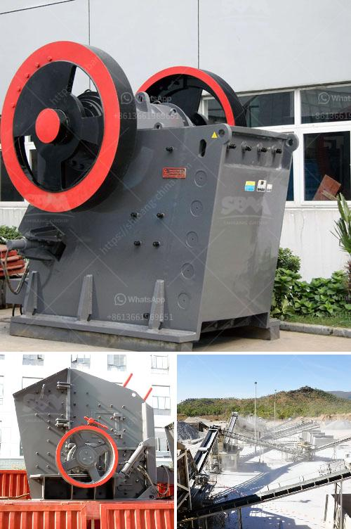

<h3>industrial roller mills</h3>
Industrial roller mills are essential machines in various industries, particularly in the milling and food processing sectors. These powerful devices are designed to grind, crush, and process a wide range of materials into fine powders or flour. With their efficient and reliable operation, roller mills have become indispensable in delivering consistent quality products.

One of the key advantages of industrial roller mills is their ability to process large quantities of materials continuously. This high production capacity makes them ideal for industrial-scale operations, enabling quick and efficient processing that can keep up with demanding production requirements. Their large-size rollers and powerful motors enable them to handle heavy-duty workloads without compromising on performance.

Another notable advantage of roller mills is their versatility in processing different types of materials. They can handle a broad range of products such as wheat, corn, barley, and even non-agricultural materials like minerals, chemicals, and pharmaceuticals. This flexibility allows manufacturers to use roller mills for multiple products, reducing the need for additional specialized equipment.

Industrial roller mills are known for their ability to produce consistent and uniform particle sizes. This is achieved through the precise control of roller gaps and pressure applied during the milling process. Consistent particle size is crucial in many industries, such as in the production of food and pharmaceutical products, where uniformity ensures the desired quality and performance of the end product.

In terms of operational efficiency, roller mills offer several advantages. They require minimal maintenance and are built to withstand heavy usage, reducing downtime and production interruptions. The streamlined design of roller mills also allows for easy cleaning and sanitation, meeting the stringent hygiene standards required in food production.

Modern roller mills are equipped with advanced automation and control systems, further enhancing their efficiency and performance. These systems enable operators to monitor and adjust milling parameters, such as roller speed, feed rate, and gap settings, remotely and in real-time. This ensures precise control over the milling process, resulting in consistent product quality and maximum yield.

In conclusion, industrial roller mills play a vital role in various industries, providing efficient and reliable processing solutions. With their high production capacity, versatility, and ability to deliver consistent particle sizes, these machines are indispensable in meeting the demands of modern manufacturing. Their operational efficiency, ease of use, and advanced automation capabilities make roller mills a top choice for companies seeking to optimize their milling processes. Whether in the food, pharmaceutical, or chemical industry, roller mills are essential tools for achieving cost-effective and high-quality production.
<h3>Contact us</h3><ul><li><strong>Whatsapp:&nbsp;<a href="https://wa.me/8613661969651">+8613661969651</a></strong></li><li><a href="https://swt.shibang-china.com/?git&amp;zhl&amp;industrial roller mills"><strong>Online Service(chat now)</strong></a></li></ul><h3>Related</h3><ul><li><a href='mining equipment seller in asia.md'>mining equipment seller in asia</a></li><li><a href='construction equipment made in taiwan.md'>construction equipment made in taiwan</a></li><li><a href='different part of barite and bentonite mill.md'>different part of barite and bentonite mill</a></li><li><a href='types of aggregate crushers pdf.md'>types of aggregate crushers pdf</a></li><li><a href='crusehr equipment ball mill.md'>crusehr equipment ball mill</a></li></ul>