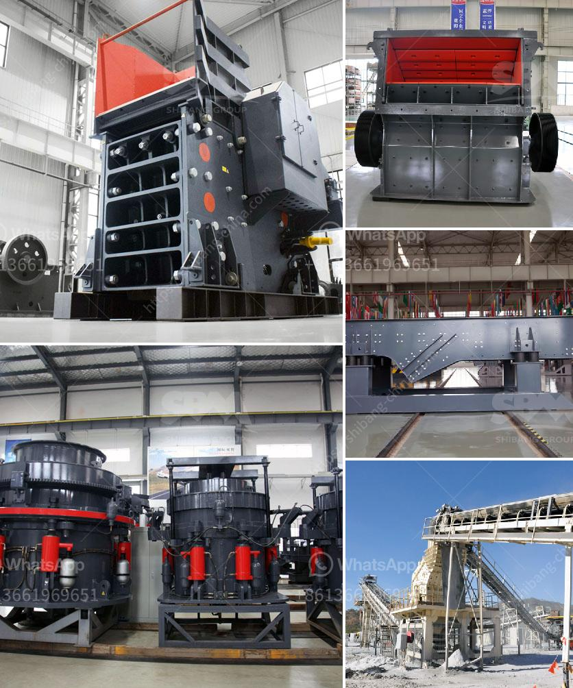

<h3>industrial rotary dryers for sale india</h3>
Industrial rotary dryers are essential equipment used in various industries for drying materials efficiently. These machines offer a cost-effective and time-saving solution for businesses that require large-scale drying processes. In India, there are numerous options available when it comes to finding industrial rotary dryers for sale.

One of the primary benefits of using an industrial rotary dryer is its ability to handle a wide range of materials. Whether it's chemicals, minerals, agricultural products, or waste materials, these dryers can effectively dry them, ensuring the desired moisture content is achieved. They are equipped with advanced technology that evenly distributes heat throughout the drum, resulting in a uniform drying process.

Indian manufacturers offer a diverse range of industrial rotary dryers to cater to different industry needs. These dryers come in various sizes and capacities, ensuring that businesses can find the perfect fit for their requirements. Additionally, they are built with high-quality materials, making them durable and long-lasting.

One of the key factors to consider when purchasing an industrial rotary dryer in India is energy efficiency. Many manufacturers offer energy-efficient dryers that are designed to minimize energy consumption and reduce operating costs. This is crucial for businesses looking to optimize their production process while keeping overheads in check.

Furthermore, Indian manufacturers provide after-sales service and technical support, ensuring that customers have access to assistance and guidance whenever required. They also offer customization options, allowing businesses to tailor the dryers to their specific needs and applications.

In conclusion, the availability of industrial rotary dryers for sale in India presents businesses with a multitude of options to meet their drying needs. With their versatility, durability, and energy efficiency, these dryers provide an effective and economical solution for a wide range of industries. It is essential for businesses to identify their requirements and engage with reputable manufacturers to find the best industrial rotary dryer that suits their needs.
<h3>Contact us</h3><ul><li><strong>Whatsapp:&nbsp;<a href="https://wa.me/8613661969651">+8613661969651</a></strong></li><li><a href="https://swt.shibang-china.com/?git&amp;zhl&amp;industrial rotary dryers for sale india"><strong>Online Service(chat now)</strong></a></li></ul><h3>Related</h3><ul><li><a href='top mobile crusher.md'>top mobile crusher</a></li><li><a href='stone grinding plant.md'>stone grinding plant</a></li><li><a href='mobile jaw crusher for sale south africa.md'>mobile jaw crusher for sale south africa</a></li><li><a href='grinding mill for sale servants.md'>grinding mill for sale servants</a></li><li><a href='coal crushing plant price.md'>coal crushing plant price</a></li></ul>