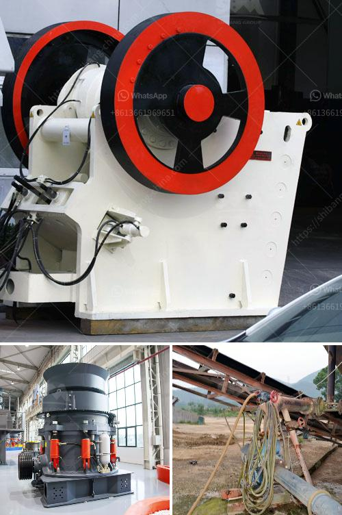

<h3>industrial vibrating feeder</h3>
Industrial vibrating feeders are crucial equipment used in various industries, including mining, construction, pharmaceuticals, food processing, and many others. These machines play a pivotal role in delivering a constant, even flow of bulk materials, ensuring the smooth operation of multiple processes within a production line. With their ability to handle a wide range of materials, industrial vibrating feeders offer numerous benefits that significantly enhance efficiency and productivity in the industrial sector.

One of the key advantages of using an industrial vibrating feeder is its ability to regulate material flow. By adjusting the amplitude and frequency of vibrations, operators can precisely control the rate at which materials are discharged, ensuring a consistent supply to downstream equipment. This eliminates the risk of clogs or overloads, preventing equipment damage, delays, and costly shutdowns. With a steady flow of materials, workers can focus on other tasks, maximizing productivity and minimizing downtime.

Another significant advantage of industrial vibrating feeders is their ability to handle a variety of materials. Whether it's granules, powders, or even fragile components, these feeders are designed to accommodate different bulk material characteristics. The equipment's design incorporates features such as adjustable gates, flexible trays, and specialized coatings to ensure gentle handling of fragile materials while maintaining optimal feed rates. This versatility allows industries to process a wide range of materials efficiently, reducing the need for additional equipment and streamlining operations.

Industrial vibrating feeders also contribute to workplace safety and ergonomics. By automatically feeding materials, operators can avoid manual handling, reducing the risk of injuries and musculoskeletal disorders. Additionally, the steady flow of materials eliminates the need for manual intervention, minimizing the exposure of workers to potentially hazardous environments. This improves overall safety and ergonomics in the workplace, fostering a more efficient and comfortable work environment.

Moreover, industrial vibrating feeders are known for their durability and low maintenance requirements. The equipment is designed to withstand harsh industrial environments, from heavy-duty construction sites to corrosive chemical facilities. Using robust materials and state-of-the-art manufacturing processes, these feeders can withstand continuous operation, requiring minimal maintenance. This reduces overall lifecycle costs and extends the lifespan of the equipment, providing long-term reliability and cost-effectiveness.

In conclusion, industrial vibrating feeders are a valuable asset for various industries, offering numerous benefits that enhance efficiency and productivity. These feeders allow for precise and consistent material flow, preventing equipment damage and ensuring uninterrupted operations. Their versatility in handling a wide range of materials further optimizes industrial processes, while their contribution to workplace safety and ergonomics creates a better working environment. Additionally, their durability and low maintenance requirements offer long-term reliability and cost savings. With such advantages, industrial vibrating feeders are an indispensable tool for any industry looking to improve its production line performance.
<h3>Contact us</h3><ul><li><strong>Whatsapp:&nbsp;<a href="https://wa.me/8613661969651">+8613661969651</a></strong></li><li><a href="https://swt.shibang-china.com/?git&amp;zhl&amp;industrial vibrating feeder"><strong>Online Service(chat now)</strong></a></li></ul><h3>Related</h3><ul><li><a href='manufacturer of barite in pakistan.md'>manufacturer of barite in pakistan</a></li><li><a href='stone crushing industry in malaysia.md'>stone crushing industry in malaysia</a></li><li><a href='concrete cube crushing machine price.md'>concrete cube crushing machine price</a></li><li><a href='crusher manufactures in europe.md'>crusher manufactures in europe</a></li><li><a href='roller mill for sale nz.md'>roller mill for sale nz</a></li></ul>