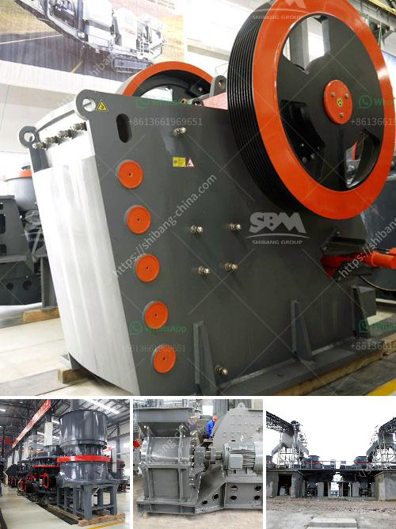

<h3>iron ore beneficiation plant consultants in india</h3>
Iron ore beneficiation plants are facing economic pressures to treat more challenging ore types, improve efficiency and improve product quality. Better control and stability of the plant process in the face of increasing feed ore variability has been a goal for many of the operations. Being able to predict the downstream physical and metallurgical performance of a given ore body is significant for effective mine planning and in predicting the performance of beneficiation processes in beneficiation plant consultants in India.

Over the years, beneficiation techniques for the processing of high-sulfur iron ores have evolved. Various types of bulk flotation and selective flotation methods have been developed to remove sulfur from ore at various stages in the beneficiation process. Special collectors and modifiers for these flotation methods are also being developed.

With the depletion of high-grade iron ores, stringent environmental regulations on mining industry, and the adoption of advanced technologies, more and more iron ore beneficiation plants are becoming interested in beneficiation consultants in India.

Iron ore beneficiation plant consultants in India provide continuous support and guidance to improve plant performance and yield. Their expertise in ore characterization and process optimization helps optimize several key plant parameters for the overall performance of the plant.

Not only do consultants help improve plant efficiency, but they also assist in the recovery of iron ore from low-grade stockpiles, tailings ponds, and other previously unprofitable mining areas. By implementing innovative beneficiation processes, these plants can unlock the economic potential of these previously untapped resources.

Iron ore beneficiation consultants in India offer services at various stages of project development, including exploration, planning, and development, market analysis, process design, material balance, engineering, and equipment supply.

The benefits of hiring beneficiation consultants are numerous. Firstly, their vast experience in the field enables them to provide valuable insights and guidance throughout the project. Moreover, with their technical know-how and industry connections, they can help clients procure the necessary equipment and services at competitive prices.

Consultants also help iron ore beneficiation plants by optimizing plant processes to enhance overall performance. Through process audit, equipment evaluation, and technological improvements, consultants can identify bottlenecks and inefficiencies in the plant and recommend appropriate solutions.

Iron ore beneficiation plant consultants in India can also help clients improve product quality, address water and energy consumption challenges, optimize operations through automation and digitalization, and develop sustainable practices.

In conclusion, iron ore beneficiation plant consultants in India play a crucial role in supporting the mining industry by advising on the best techniques and practices for optimizing operations, improving product quality, and maximizing the economic potential of low-grade ores. Their expertise and guidance enable mining companies to overcome challenges and achieve greater profitability in an increasingly complex and competitive market.
<h3>Contact us</h3><ul><li><strong>Whatsapp:&nbsp;<a href="https://wa.me/8613661969651">+8613661969651</a></strong></li><li><a href="https://swt.shibang-china.com/?git&amp;zhl&amp;iron ore beneficiation plant consultants in india"><strong>Online Service(chat now)</strong></a></li></ul><h3>Related</h3><ul><li><a href='coal crusher design calculation.md'>coal crusher design calculation</a></li><li><a href='mobile crusher on hire in tamil nadu.md'>mobile crusher on hire in tamil nadu</a></li><li><a href='jaw crusher mem fr.md'>jaw crusher mem fr</a></li><li><a href='ball mill iron ore only company.md'>ball mill iron ore only company</a></li><li><a href='hammer mill how it works.md'>hammer mill how it works</a></li></ul>