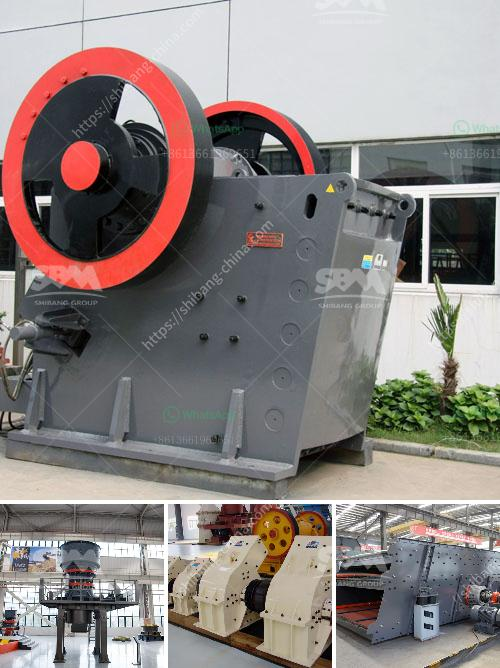

<h3>iron ore beneficiation process flow chart</h3>
Iron ore beneficiation process flow chart should be as efficient and simple. So for iron ore beneficiation equipment, processing technology has put forward higher requirements, such as grasping the development of energy-saving equipment, as far as possible to achieve the best results in the most appropriate process.

Shanghai SBM mining machinery is pioneer in the field of iron ore beneficiation plant and iron ore benefication flow chart. We have decades of professional experience in the development and production of beneficiation equipment, and our products are exported to all over the world.

The iron ore beneficiation process flow chart starts with the mining of iron ore. If you want to get more detailed product information and prices, ZME recommend that you get in touch with us through online chat. In the iron ore beneficiation process flow chart, the iron ore contains iron and other raw materials such as aluminum, silica, or silicate. It is a complicated system including crushing, grinding, beneficiation, and dehydration. It greatly affects the efficiency of subsequent work and the quality of beneficiation products.

Detailed analysis of sand and stone equipment, especially in the current resource shortage and environmental pollution situation, under the situation that the state vigorously advocates environmental protection, the overall requirements for the beneficiation technology and equipment of iron ore are getting higher and higher. At the same time, there are a series of new requirements and trends for technological transformation and upgrading in front of beneficiation process.

On the whole, the demands of iron ore beneficiation process requirements are higher, such as grasping the development of energy-saving equipment, as far as possible to achieve the best results in the most suitable process. The iron ore beneficiation process flow chart shows the basic steps for upgrading the iron ore to its concentrate and tailings, which occur naturally. At the top of the process, the ore is graded through screens and then crushed. The ore is then classified and the fine particles are removed through spiral concentrators.

As the demand for iron ore continues to increase, especially in emerging economies, the beneficiation process flow chart is becoming more and more important to gain higher iron grade concentration. In order to meet the market demands, we continue to improve our beneficiation technology, update our equipment, and enhance our overall competitiveness.

In conclusion, iron ore beneficiation process flow chart hope to be normal production of iron ore beneficiation equipment in order to meet the needs of production. All customers should promptly contact the manufacturer to buy iron ore beneficiation equipment. In addition to the above aspects, we must strengthen the management and maintenance of beneficiation equipment, take strict precautions, and strengthen the management and maintenance of beneficiation equipment. By doing so, the beneficiation equipment can work more normally and efficiently produce high-quality ore concentrates.
<h3>Contact us</h3><ul><li><strong>Whatsapp:&nbsp;<a href="https://wa.me/8613661969651">+8613661969651</a></strong></li><li><a href="https://swt.shibang-china.com/?git&amp;zhl&amp;iron ore beneficiation process flow chart"><strong>Online Service(chat now)</strong></a></li></ul><h3>Related</h3><ul><li><a href='mets ball mill specification.md'>mets ball mill specification</a></li><li><a href='mobile stone crusher from taiwan.md'>mobile stone crusher from taiwan</a></li><li><a href='toner powder making machine.md'>toner powder making machine</a></li><li><a href='mobile asphalt plant for sale in dubai.md'>mobile asphalt plant for sale in dubai</a></li><li><a href='manganese limestone processing unit.md'>manganese limestone processing unit</a></li></ul>