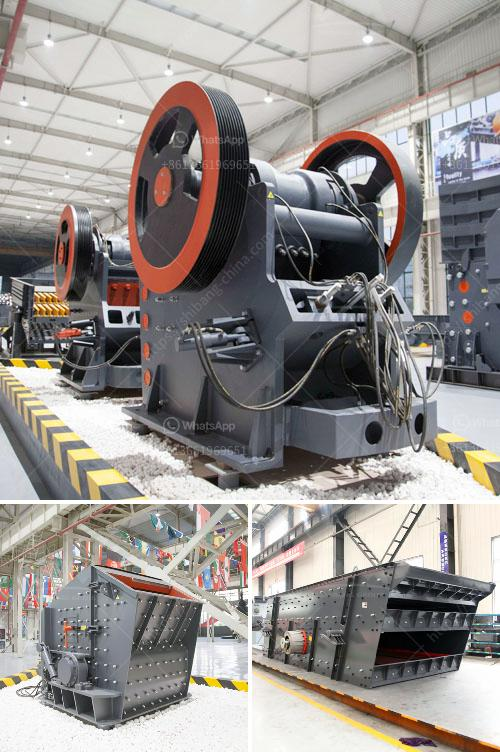

<h3>iron ore crusher in pakistan</h3>
Pakistan has abundant mineral resources. Among them, iron ore reserves are very rich. There are about 947.5 million tons iron ore have been proven.Iron ores are distributed in the four provinces of Pakistan,but mainly in Punjab and Baluchistan. Currently, we are working on a large-scale project of iron ore mining, aiming to bring Pakistan’s economic development to a new level.

Pakistan has rich iron ore resource. In general, the iron ore processing line includes crushing, grinding, beneficiation and other steps. Using our efficient cone crusher in Pakistan iron ire mining has a lot of advantages. Iron ore resource in Pakistan

Pakistanhas abundant mineral resources. Among them, iron ore reserves are very rich. There are about 947.5 million tons iron ore have been proven.Iron ores are distributed in the four provinces of Pakistan,but mainly in Punjab and Baluchistan. Currently, we are working on a large-scale project of iron ore mining, aiming to bring Pakistan’s economic development to a new level.

Pakistan has rich iron ore resource. In general, the iron ore processing line includes crushing, grinding, beneficiation and other steps. Using our efficient cone crusher in Pakistan iron ire mining has a lot of advantages.

Iron ore crusher machines sale in India is based on the extensive use of the market, determined customer demand crushing equipment: iron ore, so it is often referred to as "iron ore crusher."

ISC efficient hydraulic cone crusher: crushing ability, high efficiency, a variety of crushing chamber, suitable for limestone, basalt, sandstone, pebbles, etc .. It has a higher crushing efficiency and greater crushing ratio, greatly improving production efficiency.

Iron ore crusher machines operate directly under the premise of the material crushing: a process, for the customer plays the role of iron ore species. Iron ore crusher machines performance has been greatly improved, expanding the scope of application of iron ore.

Pakistan has abundant resources. Of course, it is easy to draw a lot of concrete examples, such as the iron ore crusher machine for sale with different prices based on different production requirements. It is better to choose the appropriate crushing cavity form according to the material properties, to achieve the desired effect, ensure that the product size requirements. Choosing a specific equipment project, the reasonable to ensure that the investment of time income.

Pakistan is located in the center of the sub-Indian peninsula, Indian Ocean to the Arabian Sea. Pakistan mainly contains baluchistan, Punjab, northwest frontier, and the Khyber four provinces, including Punjab Province, Baluchistan is rich in iron ore. Besham area, now Pakistan's Khyber parking province of the famous rich iron ore deposits, Mulla Valley is the largest iron ore deposits there, the reserves of 35 million tons. In the rest of the area sheer laziness, that large quantities of iron ore resources.

Also, Pakistan has rich deposits of a variety of other minerals, including coal, copper, gold, chromite, mineral salt, bauxite, etc. Many of them are found in Baluchistan.

Since Pakistan, for many years, it has always been to make it work among the many ore crushing equipment, unified management and control of a strong mandatory means. Then here we look at the application of new iron ore crusher machines in Pakistan industry output increased year by year, growth is still close to 50%. Increase productivity, environmental protection degree intensified, technological level has a growing trend, which shows in the iron ore crusher and gradually become an important tool.
<h3>Contact us</h3><ul><li><strong>Whatsapp:&nbsp;<a href="https://wa.me/8613661969651">+8613661969651</a></strong></li><li><a href="https://swt.shibang-china.com/?git&amp;zhl&amp;iron ore crusher in pakistan"><strong>Online Service(chat now)</strong></a></li></ul><h3>Related</h3><ul><li><a href='harga jaw crusher x.md'>harga jaw crusher x</a></li><li><a href='gold milling equipment prices.md'>gold milling equipment prices</a></li><li><a href='jaw crusher size and capacity.md'>jaw crusher size and capacity</a></li><li><a href='hammer mill in china.md'>hammer mill in china</a></li><li><a href='crusher machine manufacturers in pakistan.md'>crusher machine manufacturers in pakistan</a></li></ul>