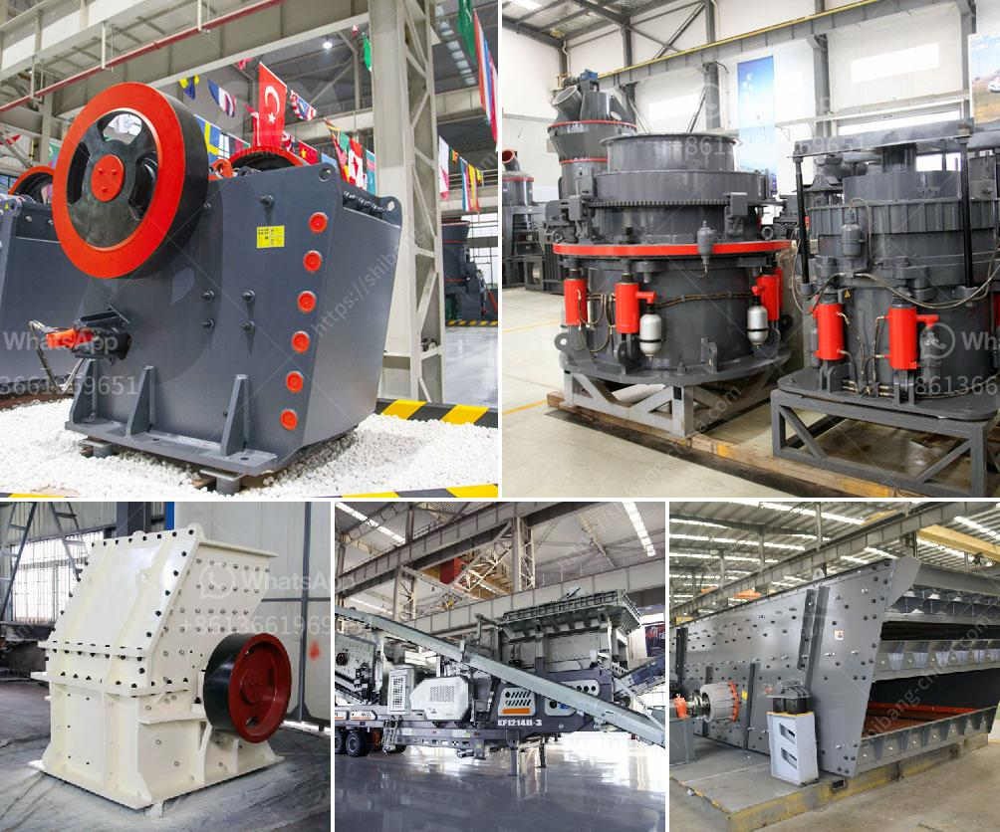

<h3>iron ore crusher price</h3>
Iron ore crusher prices are closely related to the dynamics of the iron ore industry. With the rapid rise in iron ore prices, the iron ore crusher price has also followed suit. However, prices will remain relatively high in the near future, as demand will most likely surpass supply in the coming years.

Iron ore, one of the main raw materials for the steel industry, is essential for the production of various metal products and machinery. As steel consumption continues to increase globally, the demand for iron ore has also surged. This has resulted in a significant rise in iron ore prices over the past few years.

The volatile nature of iron ore prices is primarily driven by supply and demand dynamics. For instance, in 2019, the global iron ore market experienced a decline in supply due to production disruptions in Brazil and Australia. This resulted in a sharp increase in prices. However, as the world's largest iron ore producers ramped up output in 2020, the prices stabilized.

In addition to supply-side disruptions, factors such as trade policy changes and geopolitical tensions can also impact iron ore prices. For example, trade tensions between China and Australia have created uncertainties for the iron ore market, leading to price fluctuations.

As of now, the iron ore crusher price remains relatively high, reflecting the strong demand for iron ore. Steel production in China, the world's largest consumer of iron ore, continues to soar as the country aims to support its post-pandemic economic recovery. Moreover, increased infrastructure spending in various countries has further driven up the demand for steel and subsequently iron ore.

However, as iron ore prices continue to surge, there are concerns about the sustainability of this trend. Various factors can potentially impact iron ore prices in the future, including changes in steel demand, environmental regulations, and the development of alternative materials. Furthermore, the global iron ore market is susceptible to geopolitical tensions, which can disrupt supply chains and affect prices.

In conclusion, the iron ore crusher price has experienced significant fluctuations due to supply and demand dynamics, trade tensions, and geopolitical uncertainties. While prices remain high at present, the future of iron ore prices will depend on various factors that influence the global steel industry. As the industry continues to evolve, it is crucial for stakeholders to closely monitor market conditions and adapt to the changing landscape.
<h3>Contact us</h3><ul><li><strong>Whatsapp:&nbsp;<a href="https://wa.me/8613661969651">+8613661969651</a></strong></li><li><a href="https://swt.shibang-china.com/?git&amp;zhl&amp;iron ore crusher price"><strong>Online Service(chat now)</strong></a></li></ul><h3>Related</h3><ul><li><a href='limestone processing equipment in south africa.md'>limestone processing equipment in south africa</a></li><li><a href='south africa suppliers of chrome ore beneficiation plant.md'>south africa suppliers of chrome ore beneficiation plant</a></li><li><a href='dolomite mining crusher process.md'>dolomite mining crusher process</a></li><li><a href='stone crusher plant in ghana.md'>stone crusher plant in ghana</a></li><li><a href='china stone crusher pe 400 specs.md'>china stone crusher pe 400 specs</a></li></ul>