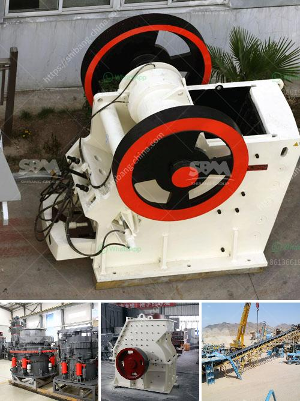

<h3>iron ore mines buyers in india</h3>
In recent years, India has emerged as a significant player in the global iron ore industry. The country's vast reserves of high-quality iron ore have attracted the attention of buyers from all over the world. These buyers, comprising both domestic and international players, are keen on tapping into India's lucrative market to meet their iron ore requirements.

Indian iron ore mines buyers primarily consist of steel manufacturers, both large-scale integrated plants and smaller secondary steel producers. These buyers rely on iron ore as the primary raw material to produce steel, which is a crucial component in various industries, including construction, automobile, and infrastructure. With India's booming economy and increasing industrialization, the demand for steel has surged, thereby driving the need for iron ore.

Domestic buyers in India focus on acquiring iron ore from local mines to ensure a steady supply of raw material. They collaborate with mining companies to establish long-term contracts and partnerships, which provide them with a reliable source of iron ore. Additionally, these buyers actively engage in trade agreements with international mining companies to augment their raw material supply.

International buyers, on the other hand, seek opportunities in India due to the country's vast reserves and competitive pricing. They engage in import and trade strategies to secure iron ore from Indian mines. These buyers often establish strategic alliances with Indian mining companies, enabling them to access large quantities of iron ore at competitive rates.

Furthermore, due to the stringent environmental regulations and sustainability initiatives implemented globally, Indian iron ore mines buyers are increasingly emphasizing sustainable sourcing practices. They aim to procure iron ore from environmentally responsible mines that adhere to strict sustainability standards. This shift towards sustainable procurement aligns with the international buyers' requirements and ensures a responsible supply chain.

Overall, the iron ore mines buyers in India are a diverse group comprising the domestic steel industry and international players seeking to tap into India's abundant iron ore resources. While domestic buyers focus on securing a steady supply of raw material, international buyers are attracted to India's competitive prices and quality products. With an emphasis on sustainability, Indian iron ore mines buyers are poised to contribute to the responsible growth of the global iron ore industry.
<h3>Contact us</h3><ul><li><strong>Whatsapp:&nbsp;<a href="https://wa.me/8613661969651">+8613661969651</a></strong></li><li><a href="https://swt.shibang-china.com/?git&amp;zhl&amp;iron ore mines buyers in india"><strong>Online Service(chat now)</strong></a></li></ul><h3>Related</h3><ul><li><a href='ethiopia cone crusher for sale.md'>ethiopia cone crusher for sale</a></li><li><a href='suppliers of conveyor belts in malaysia.md'>suppliers of conveyor belts in malaysia</a></li><li><a href='coal crushing plant price.md'>coal crushing plant price</a></li><li><a href='supplier for crusher.md'>supplier for crusher</a></li><li><a href='crusher business for sale in oman.md'>crusher business for sale in oman</a></li></ul>