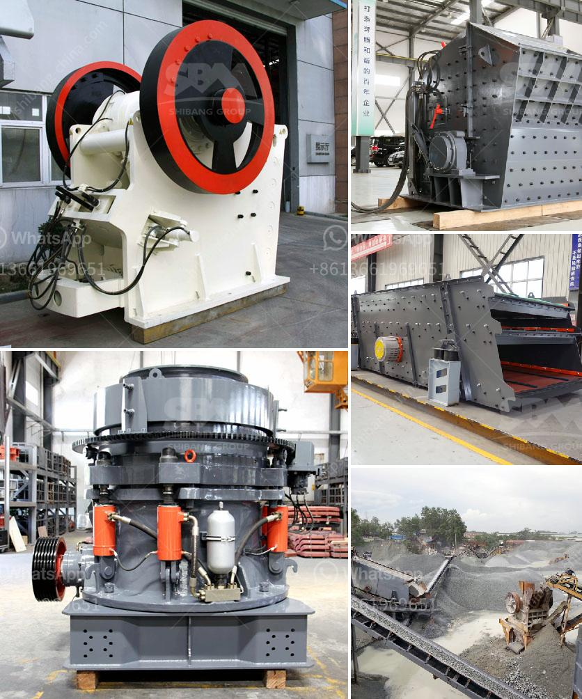

<h3>iron ore mines cost structure</h3>
Iron ore mining is a critical industry in driving economic growth and development. This vital natural resource is used in various sectors, including construction, infrastructure, and manufacturing. Understanding the cost structure of iron ore mines is essential in making informed decisions and ensuring sustainable operations.

The cost structure of iron ore mines comprises several components. The primary expenditures include extraction, processing, transportation, and overhead costs. Let's delve deeper into each of these elements.

Extraction costs represent a significant portion of the overall cost structure. This includes expenses related to the acquisition of land, exploration, and development of the mine site. Additionally, labor costs associated with operating and maintaining the mining equipment, as well as energy, explosives, and consumables, contribute to the extraction expenses. These costs are highly contingent on numerous factors, such as the depth and accessibility of the ore deposit, the quality of the resources, and the geological conditions.

Processing costs play a crucial role in iron ore mines cost structure. Once the ore is extracted, it undergoes several processing steps to remove impurities and transform it into a marketable product. Crushing, grinding, and screening operations require significant energy consumption and specialized machinery. The cost of machinery, labor, energy, and maintenance needed for these processes directly impacts the overall production costs.

Transportation costs are another key component. Iron ore mines are often located in remote areas, which add complexities and expenses to the transportation logistics. The ore needs to be transported from the mine site to the processing plant, and eventually, to the end-user. These costs encompass the infrastructure required, such as railways, ports, and roads, as well as fuel expenses and shipping fees. The distance, route, and mode of transportation all affect the overall transportation costs of iron ore.

Overhead costs cover a wide range of activities and expenses that are necessary for the functioning of the iron ore mine but are not directly linked to extraction, processing, or transportation. This includes costs associated with administration, management, legal compliance, environmental measures, health and safety standards, and community engagement. Overhead costs may also include exploration for future mining sites or investments in research and development to improve operational efficiency and reduce environmental impact.

It is important to note that the cost structure of iron ore mines can vary significantly depending on various factors, such as the geographical location, scale of operations, technological advancements, labor market conditions, and regulatory environment. These factors can impact the productivity, cost-effectiveness, and profitability of the mining operations.

Understanding the cost structure of iron ore mines is essential for mining companies, investors, and policymakers. It helps in determining the viability of new projects, analyzing the competitiveness of different mines, and formulating strategies for cost reduction and operational optimization. Moreover, a comprehensive understanding of the cost structure enables stakeholders to make informed decisions about investments, pricing, and resource allocation, ensuring the long-term sustainability and profitability of the iron ore mining industry.
<h3>Contact us</h3><ul><li><strong>Whatsapp:&nbsp;<a href="https://wa.me/8613661969651">+8613661969651</a></strong></li><li><a href="https://swt.shibang-china.com/?git&amp;zhl&amp;iron ore mines cost structure"><strong>Online Service(chat now)</strong></a></li></ul><h3>Related</h3><ul><li><a href='conveyor belts in merida.md'>conveyor belts in merida</a></li><li><a href='mining machine and equipments for limestone.md'>mining machine and equipments for limestone</a></li><li><a href='gypsum board machinery turkey manufacturers.md'>gypsum board machinery turkey manufacturers</a></li><li><a href='how to setting up of stone crusher unit.md'>how to setting up of stone crusher unit</a></li><li><a href='jual beli stone crusher bekas.md'>jual beli stone crusher bekas</a></li></ul>