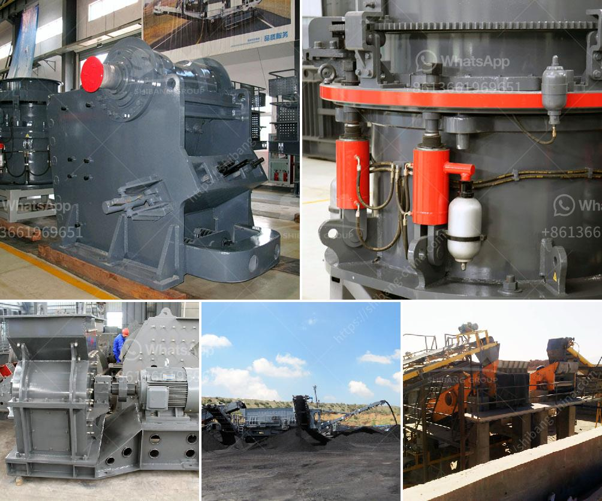

<h3>iron ore mobile crusher available in india</h3>
Iron ore is an important raw material for the steel industry. In addition, it is also widely used in industries such as automobiles, household appliances, construction, railways, and infrastructure. India is rich in iron ore resources, and it is one of the top 10 iron ore producers in the world.

With the rapid economic development and the increasing demand for steel, the demand for iron ore crusher machines in India is also increasing. To meet the needs of various industrial sectors, the iron ore mobile crusher has been developed and launched.

With the rapid progress of mining technology, the cone crusher can be divided into four types: compound cone crusher, spring cone crusher, hydraulic cone crusher, and gyratory crusher. As a common crushing equipment for the iron ore processing, the iron ore mobile crusher is specially designed for the iron ore mobile crushing process.

The iron ore mobile crusher is a series of SBM technology development and launch of new rock crushing equipment, greatly expanding the coarse crushing, fine crushing concept field. The purpose of its design is to stand in the position of customers, to provide them with an efficient, low-cost operation of the project hardware.

Iron ore mobile crusher is mainly used in steel and iron industry for smelting iron and steel. According to statistics, the recoverable reserves of iron ore in the whole world are about 93 billion tons. The main producing countries of iron ore are Australia, Brazil, India, Russia, Ukraine, and South Africa. The ranking of the world's iron ore reserves is Australia, Russia, Brazil, Ukraine, India, and China.

India's iron ore crusher production has the advantages of high efficiency, low energy consumption, high handling capacity, and good grain shape. According to the requirements of users, the iron ore mobile crusher can be configured different types. Such as mobile jaw crusher, mobile impact crusher, mobile cone crusher, and mobile VSI crusher.

Iron ore mobile crusher is the best equipment for iron ore mining. It is also suitable for crushing various stone and ores such as limestone, granite, basalt, iron ore, river pebbles, coal, etc. In the crushing industry, the maximized capacity can reach 1000t/h.
<h3>Contact us</h3><ul><li><strong>Whatsapp:&nbsp;<a href="https://wa.me/8613661969651">+8613661969651</a></strong></li><li><a href="https://swt.shibang-china.com/?git&amp;zhl&amp;iron ore mobile crusher available in india"><strong>Online Service(chat now)</strong></a></li></ul><h3>Related</h3><ul><li><a href='industrial vibrating feeder.md'>industrial vibrating feeder</a></li><li><a href='small portable swing jaw crushers.md'>small portable swing jaw crushers</a></li><li><a href='ultra fine mill price.md'>ultra fine mill price</a></li><li><a href='rubber conveyor belt pdf.md'>rubber conveyor belt pdf</a></li><li><a href='ball mill price list philippines.md'>ball mill price list philippines</a></li></ul>