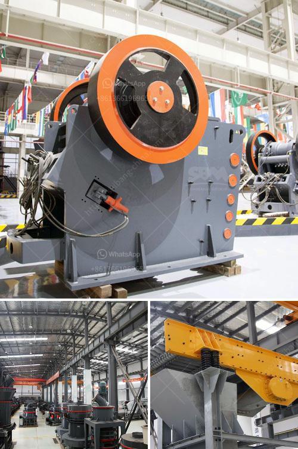

<h3>iron ore primarysecondary and tertiary crusher</h3>
Iron ore is the key raw material for steel production enterprises. Generally, iron ore with a grade of less than 50% needs to be processed before smelting and utilization. After crushing, grinding, magnetic separation, flotation, and gravity separation, etc., iron is gradually selected from the natural iron ore. The beneficiation process should be as efficient and simple as possible, such as the development of energy-saving equipment, and the best possible results with the most suitable process.

In the iron ore crushing production line, the primary crushing takes place through a jaw crusher. As the name implies, the primary crusher is responsible for crushing the raw material into smaller pieces making them suitable for further processing. However, the jaw crusher can also be used to break down rocks other than iron ore. These minerals like copper, lead, lithium, and zinc can often be processed by secondary or tertiary crushers, known as cone crushers.

The secondary crushing stage is widely used in building materials, mining, metallurgy, chemical industry, etc. Both hydraulic cone crusher and impact rock crusher are commonly used as secondary crushing equipment, tertiary crushing is generally carried out using cone crushers or impact rock crushers. According to different situations, these tools can be combined mechanically with different speed and cavity types to meet the needs of different users, such as counterattack breaking, vertical impact breaking, cone breaking, etc.

When crushing iron ore, the final products produced are called iron ore fines (particles with size less than 8mm). In the iron ore crushing production line, in order to improve the production efficiency of iron ore crusher, reduce production costs, and achieve economies of scale, a common crushing method, known as “multi-stage crushing with single-stage grinding" has been well established. This process consists of several stages, including the primary crushing stage (jaw crusher or impact crusher), the secondary crushing stage (cone crusher or impact crusher), and the tertiary crushing stage (roll crusher, hammer crusher), all operating in sequence. In this way, the iron ore can be gradually reduced from large pieces to small pieces of 8mm.

With the increasing demands on iron ore, the crushing equipment commonly used in iron ore processing, such as jaw crusher, cone crusher, impact crusher, and hammer crusher, has do not meet the requirements. The emergence of new crushers such as the composite crusher and the roller crusher has revitalized the iron ore crushing production line and broken the technological bottleneck of traditional crushers. The composite crusher combines the advantages of both hammer crusher and counter impact crusher, and is more suitable for crushing medium-hard and hard materials, such as limestone and coal gangue. The roller crusher is suitable for crushing medium and high hardness materials, such as iron ore, quartz stone, and ceramics.

In summary, iron ore crushers can be widely used in mineral processing, metallurgy, construction, chemical and other fields. When crushing iron ore, it is particularly important to choose the most suitable iron ore crusher. Different types of iron ore crushers have different working principles. Choose the right iron ore crusher depending on the properties of the ore, hardness, feed size, output size, etc., and put it to work in the beneficiation process.
<h3>Contact us</h3><ul><li><strong>Whatsapp:&nbsp;<a href="https://wa.me/8613661969651">+8613661969651</a></strong></li><li><a href="https://swt.shibang-china.com/?git&amp;zhl&amp;iron ore primarysecondary and tertiary crusher"><strong>Online Service(chat now)</strong></a></li></ul><h3>Related</h3><ul><li><a href='bentonite powder mill manufacturers.md'>bentonite powder mill manufacturers</a></li><li><a href='rock crushers under 50 tonne per hour.md'>rock crushers under 50 tonne per hour</a></li><li><a href='product of 100 tons mini cement plant.md'>product of 100 tons mini cement plant</a></li><li><a href='ball mill koppers.md'>ball mill koppers</a></li><li><a href='high energy ball milling process.md'>high energy ball milling process</a></li></ul>