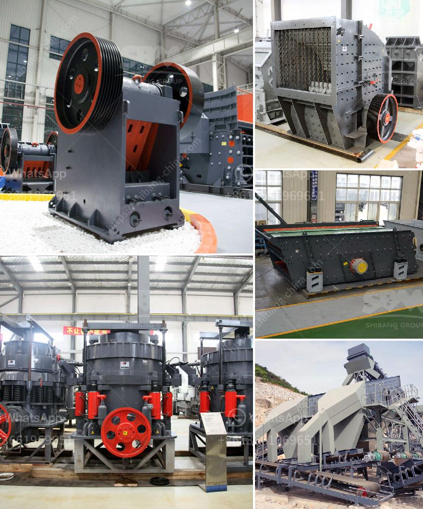

<h3>iron ore process crushing</h3>
Iron ore is an important raw material for iron and steel production enterprises. Natural ore (iron ore) is gradually selected by crushing, grinding, magnetic separation, flotation, gravity separation and other procedures. According to the mineral processing process, the ore is divided into different stages of crushing, coarse crushing, medium crushing and fine crushing. With the increasing demands for iron ore, the crushing process is also continuous improvement.

Before iron ore can be used in a blast furnace, it must be extracted from the ground and partially refined to remove impurities. Extraction and refining are separate stages in the iron ore production process. Extraction involves the removal of ore from the ground. There are many types of extraction equipment, usually used in quarrying and mining operations. Some of the common equipment models include cone crushers, jaw crushers, impact crushers, sand making machines, vibrating screens, etc. Crushers are a common crushing machine which is used for different iron ore fine crushing, which can meet the various production requirements of iron ore.

The common problem in the iron ore crushing production line is that the wear parts of the fine crusher are seriously worn out, and the repair and maintenance of the fine crusher are too frequent, which makes the production efficiency of the iron ore crushing production line lower. Therefore, the selection of an efficient and wear-resistant iron ore crusher will greatly help the entire iron ore production line.

Choosing the right iron ore crusher is based on the application of the ore. If a jaw crusher is appropriate, it can be used in crushing high hardness, medium hardness, and soft ores. Then, how to select the appropriate jaw crusher should be based on a comprehensive assessment, such as hardness of ore, size of crushed products, yield, and the like.

Different iron ore crushing machines can be selected according to various requirements. If the fine powder production requirement is high, the fine crusher can be used. The equipment includes vibrating feeder, jaw crusher, counterattack crusher, vertical impact crusher, vibrating screen, belt conveyor, etc.

1. Small size, light weight, easy to move: the design of the iron ore crushing process equipment is humanized, so that the operation is more convenient and the relocation is more flexible.

2. Low maintenance and operation cost: the crusher has large crushing force, high efficiency, high handling capacity, low operation cost and easy maintenance.

3. Good grain shape: the iron ore crusher adopts vertical shaft impact crusher to make the finished product with uniform particle size, which effectively reduces the needle-like particles, and the finished stone has good granular shape.

The iron ore crushing process should choose crushing equipment suitable for crushing medium and high hardness materials. The nature of the iron ore that needs to be crushed should be reasonable. After screening and classification, it is to be better sold as a finished product or to obtain high-quality concentrate according to the nature of the selected ore. Ensure the efficient production of the entire iron ore production line, reducing the waste of resources, maximizing the value of the final product, and creating more economic benefits for the enterprise.
<h3>Contact us</h3><ul><li><strong>Whatsapp:&nbsp;<a href="https://wa.me/8613661969651">+8613661969651</a></strong></li><li><a href="https://swt.shibang-china.com/?git&amp;zhl&amp;iron ore process crushing"><strong>Online Service(chat now)</strong></a></li></ul><h3>Related</h3><ul><li><a href='cost of used crusher for granite.md'>cost of used crusher for granite</a></li><li><a href='vibrating screens australia.md'>vibrating screens australia</a></li><li><a href='stone crusher china.md'>stone crusher china</a></li><li><a href='milling machine made in russia manufacturer in india.md'>milling machine made in russia manufacturer in india</a></li><li><a href='roller mill for gravel.md'>roller mill for gravel</a></li></ul>