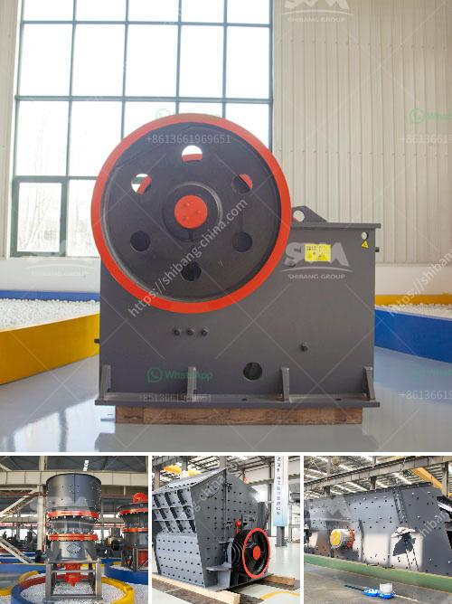

<h3>iron processing machine in mexico</h3>
Mexico stands as a significant player in the global iron processing industry, being one of the top producers and exporters of iron and steel products. The country's robust iron processing machine sector plays a crucial role in supporting this growth. With a combination of technological advancements and skilled craftsmanship, Mexican iron processing machines have gained recognition worldwide.

Mexican iron processing machines are known for their efficiency, high performance, and durability. These machines undergo intricate processes, such as smelting, molding, and shaping of iron, to produce a wide range of products, including pipes, bars, rods, sheets, and coils. The machines operate using state-of-the-art technology, ensuring precision and accuracy throughout the manufacturing process. This results in high-quality iron products that meet international standards.

One of the main advantages of Mexican iron processing machines is their cost-effectiveness. The country's favorable labor costs, coupled with advancements in automation systems, enable manufacturers to produce iron products at competitive prices without compromising on quality. This has contributed to Mexico's increasing market share in the global iron and steel industry.

In recent years, Mexico has also witnessed significant investment in research and development of iron processing machines. The government, in collaboration with private entities, has established research centers and institutes to promote innovation and enhance the performance of these machines. This continuous focus on technological advancements ensures that Mexican iron processing machines remain at the forefront of the industry.

Mexico's strategic geographical location has also played a pivotal role in the growth of its iron processing machine sector. The country serves as a gateway to the lucrative markets of North America and Latin America, facilitating the export of iron products manufactured using Mexican machines. This accessibility has attracted international investors and has further boosted the industry's growth.

In conclusion, Mexico's iron processing machine sector has emerged as a major player in the global market. The combination of advanced technology, skilled labor, cost-effectiveness, and strategic location has propelled the growth of this industry. Mexican iron processing machines continue to gain recognition for their efficiency and high-quality output, making them a preferred choice for manufacturers worldwide. With ongoing investments in research and development, Mexico is poised to further strengthen its position in the iron processing machine industry in the years to come.
<h3>Contact us</h3><ul><li><strong>Whatsapp:&nbsp;<a href="https://wa.me/8613661969651">+8613661969651</a></strong></li><li><a href="https://swt.shibang-china.com/?git&amp;zhl&amp;iron processing machine in mexico"><strong>Online Service(chat now)</strong></a></li></ul><h3>Related</h3><ul><li><a href='calcium carbonate manufacturing process.md'>calcium carbonate manufacturing process</a></li><li><a href='mineral pulverizer to 300 micron.md'>mineral pulverizer to 300 micron</a></li><li><a href='stone crushing machine price.md'>stone crushing machine price</a></li><li><a href='iron sand processing plant for sale in pakistan.md'>iron sand processing plant for sale in pakistan</a></li><li><a href='jaw crusher in china.md'>jaw crusher in china</a></li></ul>