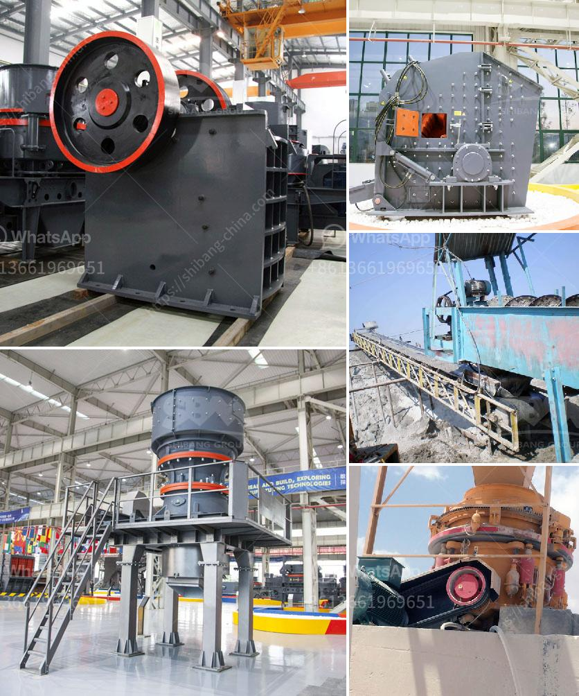

<h3>iron processing plant for sale</h3>
Iron processing plants are essential facilities that process iron ore into usable products for various industries. These plants are equipped with specialized machinery and equipment to extract, refine, and shape iron into different forms, such as bars, plates, tubes, and wires. With the increasing demand for iron and steel worldwide, the sale of iron processing plants has become a lucrative business opportunity.

Iron processing plants for sale provide a turnkey solution for entrepreneurs or companies looking to venture into the iron and steel industry. These plants are usually fully operational, allowing the new owner to immediately start producing iron products without the need for extensive setup or development. The sale of an iron processing plant may include the land, buildings, and machinery required for the operations.

Investing in an iron processing plant offers several advantages. Iron is a crucial raw material in many industries, including construction, automotive, shipbuilding, and manufacturing. By owning a processing plant, entrepreneurs can secure a consistent supply of iron products, ensuring a steady source of revenue. Additionally, the ability to process and shape iron provides opportunities for customization and meeting specific client requirements.

The cost of a ready-to-operate iron processing plant can vary depending on its size, capacity, and location. Plants with larger capacities and prime locations may have higher price tags due to the potential for greater production and accessibility. However, these factors also contribute to the plant's profitability and market competitiveness.

Prospective buyers should consider the plant's condition, technological capabilities, and compliance with environmental regulations before finalizing a purchase. Conducting a thorough inspection and due diligence is crucial to understand the plant's efficiency, potential for expansion, and any required upgrades or maintenance.

Acquiring an iron processing plant for sale provides an excellent opportunity for entrepreneurs and companies to enter or expand their presence in the iron and steel industry. With the global demand for iron products continuously growing, owning a processing plant ensures a profitable and sustainable business venture.
<h3>Contact us</h3><ul><li><strong>Whatsapp:&nbsp;<a href="https://wa.me/8613661969651">+8613661969651</a></strong></li><li><a href="https://swt.shibang-china.com/?git&amp;zhl&amp;iron processing plant for sale"><strong>Online Service(chat now)</strong></a></li></ul><h3>Related</h3><ul><li><a href='mini cement plant for sale in india.md'>mini cement plant for sale in india</a></li><li><a href='coconut shell powder making machine grinding mill for sale.md'>coconut shell powder making machine grinding mill for sale</a></li><li><a href='carbonate grinding plant feasibility study.md'>carbonate grinding plant feasibility study</a></li><li><a href='vertical grinder mill.md'>vertical grinder mill</a></li><li><a href='small scale gold mill from china.md'>small scale gold mill from china</a></li></ul>